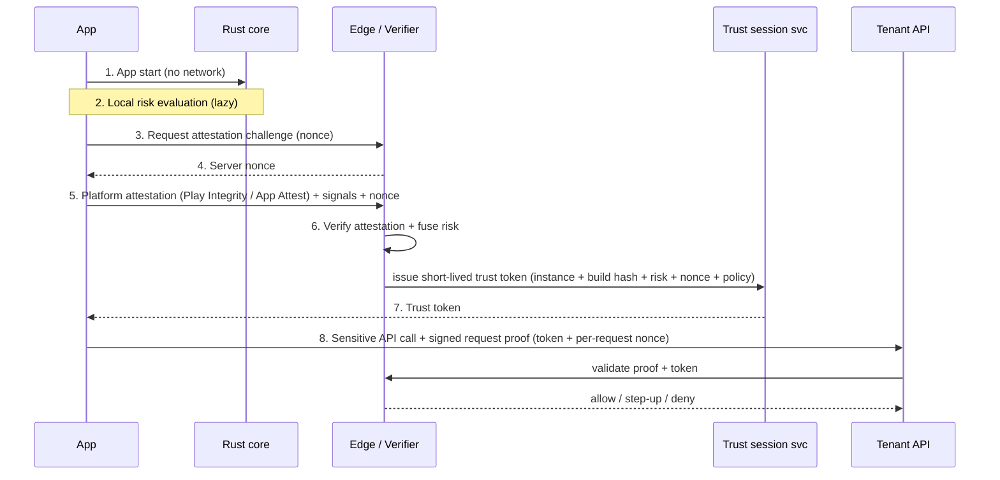

# kseal — Technical Architecture

## Table of Contents

- [System Overview](#system-overview)
- [Core Design Principle](#core-design-principle)
- [Tenant Isolation](#tenant-isolation)
- [On-Device Architecture](#on-device-architecture)
- [Build-Time Hardening](#build-time-hardening)
- [Attestation & API Protection](#attestation--api-protection)
- [Connectivity & Protocol Design](#connectivity--protocol-design)
- [Privacy Architecture](#privacy-architecture)
- [Server-Side Architecture for 100K Tenants](#server-side-architecture-for-100k-tenants)
- [Desktop Expansion](#desktop-expansion)
- [Performance Budgets](#performance-budgets)
- [Tech Stack](#tech-stack)

---

## System Overview

kseal is a four-plane architecture. Each plane has a distinct consistency model, scaling profile, and trust boundary.

```mermaid
flowchart LR
    subgraph CP["Control Plane"]
        direction TB
        IAM[Tenant IAM]
        REG[App / build registry]
        POL[Policy authoring]
        KM[Key management]
        COMP[Compliance / audit]
        BILL[Billing]
    end

    subgraph BP["Build Plane"]
        direction TB
        CLI[kseal CLI]
        GRADLE[Gradle plugin]
        XCODE[Xcode plugin]
        XFORM[Rust/C++ transforms]
        WORKER[Isolated build worker]
    end

    subgraph DEV["Device Plane"]
        direction TB
        ANDROID[Android SDK]
        IOS[iOS SDK]
        RUST[Rust trust core]
        RISKE[Local risk engine]
    end

    subgraph DP["Data Plane"]
        direction TB
        EDGE[Edge gateway]
        VER[Attestation verifier]
        TS[Trust session svc]
        ING[Event ingest]
        RISK[Risk engine]
        AW[Analytics writer]
        SIEM[Webhook / SIEM]
    end

    CP -. signs config & policy .-> BP
    CP -. signs config & policy .-> DEV
    CP -. owns rules & keys .-> DP
    BP --> DEV
    DEV --> DP
    DP -. decisions/metrics .-> CP
```

The four planes:

- **Control plane** — low volume, strongly consistent, the source of truth for tenants, policies, keys, and billing.
- **Data plane** — very high volume, eventually consistent, stateless-where-possible, never the source of truth for secrets.
- **Build plane** — runs inside the tenant's CI/CD; produces protected, signed binaries and build proofs.
- **Device plane** — runs inside the protected app; gathers signals and produces request proofs, but is never trusted to make the final decision.

---

## Core Design Principle

**Separate the control plane from the data plane.** They have opposite requirements, and conflating them is the most common way these systems become both expensive and insecure.

| Property | Control plane | Data plane |
|---|---|---|
| **Purpose** | Manage tenants, apps, builds, policies, keys, billing, compliance | Ingest signals, verify attestations, score risk, enforce policy, fan out events |
| **Volume** | Low (human + CI-driven writes) | Very high (per-device, per-request) |
| **Consistency** | Strong (source of truth) | Eventual (derived, reproducible) |
| **State** | Stateful, durable | Mostly stateless; durable streams + columnar analytics |
| **Secrets** | Owns key material (KMS/HSM) | Holds no long-lived secrets; uses short-lived, scoped credentials |
| **Blast radius** | A bug is serious but low-volume | A bug is high-volume; must fail safe and shed load |
| **Stack** | Go, Postgres/CockroachDB, object storage, KMS/HSM | Go, Kafka/Redpanda, ClickHouse, Redis/Dragonfly, CDN |
| **Scaling** | Vertical + read replicas | Horizontal, partitioned by tenant/topic |

The data plane derives everything it needs (policies, keys-by-reference, rules) from signed artifacts produced by the control plane, so it can scale horizontally without ever becoming a second source of truth.

---

## Tenant Isolation

**There is no per-tenant database schema.** Spinning up a schema (or database) per tenant does not scale to 100K tenants operationally — migrations, connection pools, and backups all explode. Instead kseal uses:

- **Logical tenant isolation by `tenant_id`.** Every row, event, stream key, and object path is namespaced by `tenant_id`, enforced at the query layer (and via row-level security where the store supports it).
- **Per-tenant keying.** Each tenant has its own key material so that data encrypted for one tenant is cryptographically inaccessible to another.
- **Quotas.** Per-tenant rate limits and ingest quotas prevent a noisy tenant from degrading others.
- **Row-level access.** Application-layer and database-layer guards ensure no cross-tenant read path.
- **Dedicated clusters only for large/regulated customers.** Physical isolation is an escalation, not the default.

### Four-tier isolation model

| Tier | Compute | Data | Keys / network | Typical customer |
|---|---|---|---|---|
| **Starter** | Shared | Shared (logical `tenant_id`) | Logical | Indie / early-stage |
| **Growth** | Shared | Partitioned | Dedicated per-tenant keys | Scaling product |
| **Enterprise** | Dedicated partitions | Dedicated partitions + quotas | Region pinning | Large mobile app |
| **Regulated** | Dedicated cluster | Dedicated cluster | Private link + CMK + optional on-prem verifier | Fintech / health / gov |

---

## On-Device Architecture

The on-device SDK is layered so that **platform-specific probes stay native** (they need raw OS APIs) while **shared trust logic lives in a single Rust core** (so behavior is identical and audited once across platforms).

### Layering

| Layer | Android | iOS | Rust core |
|---|---|---|---|
| **Platform adapter** | Kotlin/Java + JNI | Swift/ObjC | FFI boundary (UniFFI / C ABI) |
| **RASP probes** | NDK + Java APIs | Swift/ObjC + low-level C | — (signals passed in) |
| **Crypto binding** | Keystore / StrongBox | Secure Enclave / Keychain | Message formats, nonces, signing orchestration |
| **Transport** | OkHttp / native | URLSession / native | Batch framing, retry policy, compression |
| **Policy engine** | thin shim | thin shim | **Policy evaluation, risk scoring, normalization** |

### Rust core scope

The Rust core owns everything that must be **identical, deterministic, and audited once**:

- Policy evaluation and local risk scoring
- Event normalization (raw native signals → canonical event schema)
- Crypto message formats (request proofs, attestation envelopes)
- Compression (protobuf + zstd batching)
- Deterministic serialization (byte-stable output for signing/verification)
- FFI-safe shared trust logic exposed to both platforms

**Platform probes stay native** because they require OS-specific APIs (e.g. `ptrace`/`sysctl` on iOS, `/proc` and `ptrace` on Android) that cannot be portably implemented in Rust and would otherwise duplicate platform risk.

### Runtime protection modules

Nine modules make up the RASP layer. Each has a defined response model feeding the local risk engine; the **authoritative** response is decided server-side.

| # | Module | Purpose | Android implementation | iOS implementation | Response model |
|---|---|---|---|---|---|
| 1 | **App integrity** | Detect repackaging / resigning | Verify signing cert + DEX/resource hashes vs build manifest | Verify Mach-O + bundle hashes, code signature | Signal → risk; server blocks on mismatch |
| 2 | **Runtime tamper** | Detect in-memory patching | Native code/section checksums, GOT/PLT checks | Mach-O section checksums, function prologue checks | Signal → risk; step-up/block |
| 3 | **Debugger detection** | Detect attached debugger | `ptrace`, `TracerPid` in `/proc/self/status` | `sysctl` `P_TRACED`, `ptrace(PT_DENY_ATTACH)` | Signal → risk; observe then step-up |
| 4 | **Hooking framework detection** | Detect Frida/Xposed/objection | Scan maps/loaded libs, named pipes, ports | Scan dyld images, suspicious symbols, ports | High-weight signal → step-up/block |
| 5 | **Environment risk** | Root/jailbreak/emulator/sim | `su`/Magisk artifacts, build props, emulator heuristics | Jailbreak artifacts, sandbox escape checks, simulator detect | Signal → risk; policy decides |
| 6 | **Network manipulation** | Detect MITM / proxy | System proxy, user CA store, pinning failures | Proxy settings, anchor mismatch, pinning failures | Signal → risk; step-up |
| 7 | **API request proof** | Bind each sensitive request to a trusted instance | HMAC/signature over request + nonce + trust token (StrongBox key) | Same, Secure Enclave key | Server rejects invalid/replayed proofs |
| 8 | **Secret protection** | Avoid shippable static secrets | No static secrets; keys derived/hardware-bound at runtime | Same | N/A (design-level) |
| 9 | **Privacy guard** | Enforce data minimization on-device | Strip/deny disallowed signals before they enter telemetry | Same | Drop at source |

> **Default response order is `observe → step-up → block`.** A module never hard-blocks on first signal; the server fuses signals and applies policy, and `block` is only reached after policy simulation justifies it.

---

## Build-Time Hardening

Build transforms run **locally in the tenant's CI** (no per-build cloud compute), driven by the Gradle/Xcode plugins.

> **Delivered state (current build).** The Gradle (`plugins/gradle`) and Xcode (`plugins/xcode`) plugins ship with R8-aware string/resource sealing (AES-256-GCM), symbol/debug-metadata stripping, a per-build HKDF-SHA256 polymorphism seed, and a shared `kseal.build-proof/v1` manifest registered via `RegistryService.CreateBuild` (offline fallback supported). **Native hardening is now delivered**: Android `.so` CFI/MTE/BTI/PAC posture is verified per-arch by `ElfInspector` and recorded in the build proof (unsupported toolchains are reported, not silently skipped), and iOS Mach-O section-hash + load-command integrity is baked into the manifest via `kseal-harden integrity`. The **MASVS evidence report** is generated per release by `tools/masvs-report` (and `kseal build masvs`) from real build-proof data. Build-hardening depth has since been extended with per-build bytecode obfuscation (R8/mapping-preserving), broader native posture verification (RELRO/canary/FORTIFY/NX/PIE across architectures), and a **build-proof v2** manifest. **Phase 3 is complete.** See `docs/build-hardening-android.md` and `docs/build-hardening-ios.md`.

### Android

- **Gradle plugin** integrates into the existing build, after compilation, before packaging.
- **R8-compatible obfuscation extension** — layers on top of R8 rather than fighting it; consumes/produces mapping files so crash symbolication still works.
- **DEX / native library hardening** — string/resource encryption, control-flow obfuscation, native `.so` hardening.
- **Per-build polymorphism** — each build randomizes structure (symbol layout, encryption keys, check placement) so a bypass does not transfer between builds.
- **Native memory safety** — enable **CFI** (Control Flow Integrity) and **MTE** (Memory Tagging Extension) for native components where the toolchain/device supports them.

### iOS

- **XCFramework + Swift Package + Xcode build plugin** for distribution and integration.
- **Mach-O integrity** — section hashing and load-command validation baked into the build manifest.
- **Swift / ObjC hardening** — string/symbol obfuscation, metadata stripping.
- **Jailbreak / injection detection** wired in at build time.
- **App Attest integration** — provisioned during the build so the runtime can attest.

### What to avoid

| Anti-pattern | Why to avoid it |
|---|---|
| **Heavy virtualization / VM obfuscation** | Huge size + performance cost, App Store risk, marginal benefit when the real decision is server-side. |
| **Static secrets in the binary** | Any shipped secret is extractable; defeats the "no secret to steal" model. |
| **Client-only blocking** | Bypassable; gives a false sense of security and frustrates real users via false positives. |
| **Excessive device fingerprinting** | Privacy/regulatory liability; cross-tenant correlation risk. |
| **Dynamic code download / updates** | App Store rejection risk, supply-chain risk; config must be data, not code. |
| **Aggressive lockout** | False positives lock out paying users; prefer step-up and server-side decisions. |

---

## Attestation & API Protection

### Android — Play Integrity API

- Used for **sensitive actions only**, not on every request.
- Respects the **default 10,000 requests/day quota**; requests increases proactively for high-volume tenants.
- Results feed a **cached trust session** so subsequent calls reuse the established trust rather than re-attesting.

### iOS — App Attest + DeviceCheck

- **App Attest** establishes a hardware-backed key attested by Apple at first use.
- **DeviceCheck** provides per-device bits for lower-frequency signals.
- Both verified server-side by the attestation verifier.

### Trust session flow

1. App starts — **no launch-time network call**.
2. Local risk engine evaluates lazily.
3. On the first sensitive action, the app requests an attestation challenge.
4. Server returns a **nonce**.
5. App submits platform attestation + risk signals + nonce.
6. Server **verifies attestation and fuses risk**.
7. Server issues a **short-lived trust token** bound to *app instance + build hash + risk state + nonce + active policy*.
8. App calls the protected API with a **signed request proof** (trust token + per-request nonce). The server validates the proof and applies the policy decision.

### Pseudonymous identifiers

All device/app identifiers are **pseudonymous and tenant-scoped**; **no raw PII** is collected or transmitted. Identifiers rotate and cannot be correlated across tenants (see [Privacy Architecture](#privacy-architecture)).

---

## Connectivity & Protocol Design

Different traffic classes have different latency/throughput needs and use different transports.

| Traffic class | Transport | Rationale |
|---|---|---|
| **Config fetch** | HTTPS via **CDN** | Cacheable, signed, no origin hit per launch |
| **Batch telemetry** | **gRPC / Connect over HTTP/2** | Multiplexed, compact, schema-typed |
| **Low-latency calls** | **HTTP/2 now**, HTTP/3 later | Mature Go HTTP/2 stack today |
| **High-volume edge** | **HTTP/3 at edge with HTTP/2 fallback** | QUIC benefits where the edge terminates it |

### Go HTTP/3 caution

The Go ecosystem's HTTP/3 support (e.g. `x/net`'s internal HTTP/3 work) is **not production-ready**. Therefore:

- **Use HTTP/2 first** for all origin services.
- **Terminate HTTP/3 at the edge/CDN** and proxy to origins over HTTP/2.
- Adopt origin HTTP/3 only once a battle-tested Go implementation is stable.

### Compression

Telemetry batches are **protobuf + zstd**, with **shared zstd dictionaries** so even small batches compress hard. This keeps per-event wire cost minimal and directly supports the [unit economics](PROPOSAL.md#unit-economics).

---

## Privacy Architecture

Privacy is a design constraint, not a policy bolt-on.

### Default exclusions

By default kseal does **not** collect:

- GPS / precise location
- Contacts
- Advertising ID
- Installed-app inventory
- Cross-tenant device fingerprints
- Raw IP storage (used transiently for edge decisions, not persisted raw)
- Keystroke / screen / clipboard content
- Behavioral profiling

### Compact event design

Events are tiny, structured, and minimized:

- **Event types** — small enum of canonical categories.
- **Risk bits** — packed boolean/bitfield signals rather than verbose payloads.
- **Confidence levels** — coarse-grained (e.g. low/med/high), not raw scores that could re-identify.
- **Hashes** — salted, tenant-scoped hashes instead of raw values.
- **Tenant-scoped keys** — every event keyed under the tenant; rotating IDs prevent cross-tenant linkage.

### Store compliance

- **iOS privacy manifest generator** — produces the `PrivacyInfo.xcprivacy` declaring collected data + reasons.
- **Google Data Safety helper** — generates the Play Console Data Safety form inputs.
- **Machine-readable SDK data contract** — a declarative spec of exactly what the SDK collects, consumable by tenants' privacy tooling.
- **Tenant data-processing registry** — records processing purpose/retention per tenant.
- **Regional retention** — retention windows configurable per region.
- **Raw events off by default** — only aggregates are stored unless the tenant opts into (paid) raw retention.
- **Aggregates by default** — dashboards and rules run on aggregates.

---

## Server-Side Architecture for 100K Tenants

> **Delivered state (current build).** The shipped server implements the full service surface below as Go [Connect](https://connectrpc.com/) services (`RegistryService`, `TrustService`, `ConfigService`, `IngestService`, `QueryService`, `WebhookService`) over HTTP/2. Event ingest currently uses an **in-process channel broker + batched async writer** into an **in-memory analytics store**, behind `Broker`/`AnalyticsStore`/`EventSink` interfaces designed so a Kafka/Redpanda broker and a ClickHouse store drop in without touching callers (see `server/data-plane/ingest/writer.go`). The transactional source of truth is **Postgres 16** (with row-level-security tenant isolation), and **Redis 7** backs trust-session lookups and rate limits. Signing keys are sealed with AES-256-GCM envelope encryption under a 32-byte KEK via the `TenantSealer` seam: the platform KEK is the default, and **customer-managed keys (BYOK)** are delivered as a per-tenant KMS-wrapped DEK (`CMKKeyManager`, self-describing `KSC1` envelope), fail-closed on KMS error or disabled-CMK open, gated by `KSEAL_CMK_KMS_URI` (default off). Additional hardening ships behind default-off env vars: Redis TLS/AUTH (`KSEAL_REDIS_TLS`/`_PASSWORD`/`_CA_FILE`), an OTLP trace exporter (`KSEAL_OTLP_ENDPOINT`/`_SAMPLE_RATIO`), and per-tenant raw-event retention (`KSEAL_RAW_RETENTION_DAYS` + per-tenant `raw_retention_days`, with a tenant-isolated purge routine). Webhook fan-out is delivered with HMAC-SHA256 signing, retries, and per-endpoint circuit breaking. SIEM export is delivered (`server/data-plane/siem`): per-tenant connectors for Splunk HEC, Microsoft Sentinel, and Elastic with a backpressured, batched, at-least-once exporter (per-tenant circuit breaker + privacy allow-list), plus connector templates. The **`ComplianceService`** (`server/control-plane/compliance`) adds the enterprise trust & compliance surface: a hash-chained, tamper-evident, tenant-scoped append-only **audit trail** (with `VerifyAuditChain`), a machine-readable **data-processing registry**, an Ed25519-signed **kill switch** with monotonic anti-rollback versioning (serialized per scope via `pg_advisory_xact_lock`, delivered over the signed-config channel), and **canary rollout + guardrail-driven auto-rollback** with deterministic tenant/app/instance bucketing. Every RPC is additive to the v1 wire contract, requires a valid API key, and filters on the caller's tenant; new features are flag-gated and fail-safe (default off). A per-tenant **dedicated/regulated tier** is keyed off an HKDF per-tenant key domain.
>
> **Console/CLI wiring (delivered).** The compliance/ops console views (`web/console`) and the `kseal` CLI compliance commands read the canonical `kseal.v1.ComplianceService` client directly (the stream-local proto and its generated artifacts were removed once the shapes were reconciled: keyset audit list + dedicated `VerifyAuditChain`, unpaginated data-processing registry, `KillSwitchCommand`/`CanaryState` enums, single `GetCanaryStatus`). Graceful degradation is preserved — on a server that doesn't yet expose a given RPC (`UNIMPLEMENTED`/`UNAVAILABLE`) the surfaces render "not available yet" rather than erroring. Kill-switch issuance is request-only from these clients: the control plane holds the Ed25519 signing authority, so no signing happens in the browser or CLI.

### Data plane services

| Service | Responsibility |
|---|---|
| **Edge gateway** | TLS/QUIC termination, authn, quota/rate limits, malformed-request rejection, fan-in |
| **Config service** | Serves signed, cacheable config/policy via CDN |
| **Attestation verifier** | Verifies Play Integrity / App Attest / DeviceCheck and kseal proofs |
| **Trust session service** | Issues and validates short-lived trust tokens |
| **Event ingest** | Accepts batched protobuf+zstd telemetry into Kafka/Redpanda |
| **Risk engine** | Fuses signals, applies tenant policy, emits decisions |
| **Analytics writer** | Writes events/aggregates to ClickHouse with hot/cold tiering |
| **Webhook / SIEM** | Fans out decisions/events to tenant gateways, webhooks, SIEMs |

### Control plane services

| Service | Responsibility |
|---|---|
| **Tenant IAM** | Tenants, users, roles, API keys, SSO |
| **App registry** | Apps, platforms, bundle/package IDs |
| **Protection profile** | Hardening/obfuscation profiles per app |
| **Runtime policy** | Authoring + versioning of risk policies |
| **Key management** | Per-tenant keys, signing keys, KMS/HSM, CMK/BYOK (delivered) |
| **Build proof** | Records build hashes/manifests; verifies build provenance |
| **Compliance** | MASVS evidence + hash-chained audit trail (`VerifyAuditChain`) + data-processing registry + signed kill switch + canary rollout/auto-rollback (`ComplianceService`) |
| **Billing** | MAU/MAD/event/retention metering |
| **Admin console** | Internal operations and tenant support |

---

## Desktop Expansion

Desktop (**Phase 5**) reuses the trust backbone and adds platform-specific integrity modules.

> **Delivered state (current build).** Both desktop SDKs are delivered under `sdk/desktop`. **macOS** (`sdk/desktop/macos`, SwiftPM `KsealDesktop`) performs SecCode/SecStaticCode signature validity, team-id, notarization, hardened-runtime, and dylib-injection checks; **Windows** (`sdk/desktop/windows`, .NET 8 `Kseal.Desktop`) performs WinVerifyTrust Authenticode (incl. real PKCS#7 timestamp extraction), publisher/thumbprint, pure-managed PE header/section integrity, and DLL-injection checks. Both fuse local integrity signals through the Rust core via the C FFI and establish a desktop trust session over the existing `TrustService` RPCs. **Secure-updater integration** (Ed25519 verify-before-apply over a signed update channel, fail-closed on signature/rollback failure), **MDM-friendly enterprise compatibility controls** (`EnterprisePolicy` providers that fail-closed to strict policy and reject allowlist prefix-escape), and **TPM/Keychain hardware-bound proofs** are now delivered — completing Phase 5. Aggressive anti-debug is still deliberately deferred per the desktop caution.

### macOS modules

| Module | Purpose |
|---|---|
| **Code signature** | Verify Developer ID / signing identity |
| **Notarization** | Confirm Apple notarization status |
| **Hardened runtime** | Verify hardened-runtime entitlements |
| **Dylib injection** | Detect `DYLD_INSERT_LIBRARIES` and injection |
| **Debugger** | Detect attached debugger (`ptrace`/`sysctl`) |
| **Bundle tamper** | Verify bundle resource integrity |
| **Keychain binding** | Hardware/keychain-bound key for proofs |
| **API request proof** | Signed per-request proof |

### Windows modules

| Module | Purpose |
|---|---|
| **Authenticode** | Verify Authenticode signature |
| **PE integrity** | Verify PE section hashes |
| **DLL injection** | Detect injected modules |
| **Debugger** | Detect debugger presence |
| **Anti-tamper** | Runtime self-checks |
| **TPM keys** | TPM-backed key for proofs |
| **API request proof** | Signed per-request proof |

### Desktop caution

Start desktop with **API attestation, code integrity, secure update, tamper telemetry, and enterprise policy controls**. Add **aggressive anti-debug later** — desktop debugging is a legitimate developer/admin activity far more often than on mobile, so aggressive anti-debug causes more false positives and support burden early on.

---

## Performance Budgets

### SLO table

| Budget | Target |
|---|---|
| Startup overhead (p95) | **< 40 ms** |
| Resident memory | **< 3–5 MB** |
| Android binary (AAR) | **< 500 KB** |
| iOS binary slice | **< 800 KB** |
| CPU (average) | **< 0.5%** |
| Crash/ANR contribution | **near-zero** |
| Config fetch (p95) | **< 100 ms** (CDN) |
| Network at launch | **none** |

### How to stay lightweight

- **Lazy checks** — run probes on demand / on sensitive actions, not eagerly at launch.
- **Risk-driven scheduling** — increase check frequency only when risk rises.
- **Compact binary telemetry** — protobuf + zstd, packed risk bits.
- **CDN config** — signed, cacheable; never an origin hit per launch.
- **Optional modules** — tenants include only the modules they need.
- **No launch-time network** — defer/batch all telemetry; never block startup.

---

## Tech Stack

### On-device

| Concern | Choice |
|---|---|
| Android app layer | Kotlin / Java |
| Android native | NDK (C/C++) |
| iOS app layer | Swift / Objective-C |
| Shared trust core | Rust |
| Wire format | Protobuf |
| Compression | zstd (+ dictionaries) |

### Server

The **Choice** column is the scale-out target; **Delivered** is what the current build ships.

| Concern | Choice (target) | Delivered (current build) |
|---|---|---|
| Services | Go | Go |
| RPC | gRPC / Connect (HTTP/2) | Connect over HTTP/2 (h2c) |
| Streaming / ingest | Kafka / Redpanda | In-process channel broker + batched async writer (interface-compatible) |
| Analytics store | ClickHouse | In-memory analytics store (interface-compatible) |
| Transactional store | Postgres / CockroachDB | Postgres 16 (row-level-security tenant isolation) |
| Cache / sessions | Redis / Dragonfly | Redis 7 |
| Object storage | S3-compatible | Not yet used |
| Key material | KMS / HSM | AES-256-GCM envelope encryption under a 32-byte KEK (KMS/HSM-sourced in production) |
| Observability | OpenTelemetry | Prometheus metrics at `/metrics`; `/healthz` + `/readyz` health checks |
| Edge | CDN with HTTP/3 termination, HTTP/2 origin | Single Go origin over HTTP/2 |
