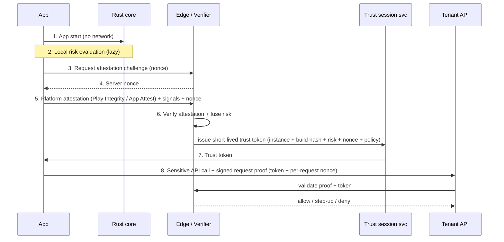

# kseal — Technical Architecture

This document describes kseal as it is built today. It uses the canonical
reference deployment **Meridian Pay** for examples; the committed fixtures,
measured benchmarks, and risk-scoring reference live in
[`docs/reference/`](docs/reference/).

## Table of Contents

- [System Overview](#system-overview)
- [Core Design Principle](#core-design-principle)
- [Tenant Isolation](#tenant-isolation)
- [On-Device Architecture](#on-device-architecture)
- [Build-Time Hardening](#build-time-hardening)
- [Attestation & API Protection](#attestation--api-protection)
- [Risk Scoring & Trust Decisions](#risk-scoring--trust-decisions)
- [Connectivity & Protocol Design](#connectivity--protocol-design)
- [Privacy Architecture](#privacy-architecture)
- [Server-Side Architecture](#server-side-architecture)
- [Desktop SDKs](#desktop-sdks)
- [Performance Budgets](#performance-budgets)
- [Tech Stack](#tech-stack)

---

## System Overview

kseal is a four-plane architecture. Each plane has a distinct consistency model,
scaling profile, and trust boundary.



```mermaid
flowchart LR
    subgraph CP["Control Plane"]
        direction TB
        IAM[Tenant IAM]
        REG[App / build registry]
        POL[Policy authoring]
        KM[Key management]
        COMP[Compliance / audit]
        BILL[Billing]
    end

    subgraph BP["Build Plane"]
        direction TB
        CLI[kseal CLI]
        GRADLE[Gradle plugin]
        XCODE[Xcode plugin]
        XFORM[Rust/C++ transforms]
        WORKER[Isolated build worker]
    end

    subgraph DEV["Device Plane"]
        direction TB
        ANDROID[Android SDK]
        IOS[iOS SDK]
        RUST[Rust trust core]
        RISKE[Local risk engine]
    end

    subgraph DP["Data Plane"]
        direction TB
        EDGE[Edge gateway]
        VER[Attestation verifier]
        TS[Trust session svc]
        ING[Event ingest]
        RISK[Risk engine]
        AW[Analytics writer]
        SIEM[Webhook / SIEM]
    end

    CP -. signs config & policy .-> BP
    CP -. signs config & policy .-> DEV
    CP -. owns rules & keys .-> DP
    BP --> DEV
    DEV --> DP
    DP -. decisions/metrics .-> CP
```

The four planes:

- **Control plane** — low volume, strongly consistent, the source of truth for
  tenants, policies, keys, and billing.
- **Data plane** — very high volume, eventually consistent,
  stateless-where-possible, never the source of truth for secrets.
- **Build plane** — runs inside the tenant's CI/CD; produces protected, signed
  binaries and build proofs.
- **Device plane** — runs inside the protected app; gathers signals and produces
  request proofs, but is never trusted to make the final decision.

---

## Core Design Principle

**Separate the control plane from the data plane.** They have opposite
requirements, and conflating them is the most common way these systems become
both expensive and insecure.

| Property | Control plane | Data plane |
|---|---|---|
| **Purpose** | Manage tenants, apps, builds, policies, keys, billing, compliance | Ingest signals, verify attestations, score risk, enforce policy, fan out events |
| **Volume** | Low (human + CI-driven writes) | Very high (per-device, per-request) |
| **Consistency** | Strong (source of truth) | Eventual (derived, reproducible) |
| **State** | Stateful, durable | Mostly stateless; durable streams + columnar analytics |
| **Secrets** | Owns key material (KMS/HSM) | Holds no long-lived secrets; uses short-lived, scoped credentials |
| **Blast radius** | A bug is serious but low-volume | A bug is high-volume; must fail safe and shed load |
| **Stack** | Go, Postgres/CockroachDB, object storage, KMS/HSM | Go, Kafka/Redpanda, ClickHouse, Redis/Dragonfly, CDN |
| **Scaling** | Vertical + read replicas | Horizontal, partitioned by tenant/topic |

The data plane derives everything it needs (policies, keys-by-reference, rules)
from signed artifacts produced by the control plane, so it can scale
horizontally without ever becoming a second source of truth.

---

## Tenant Isolation

**There is no per-tenant database schema.** A schema (or database) per tenant
does not scale operationally — migrations, connection pools, and backups all
explode. Instead kseal uses:

- **Logical tenant isolation by `tenant_id`.** Every row, event, stream key, and
  object path is namespaced by `tenant_id`, enforced at the query layer and via
  row-level security where the store supports it (Postgres 16 does).
- **Per-tenant keying.** Each tenant has its own key material so that data
  encrypted for one tenant is cryptographically inaccessible to another.
- **Quotas.** Per-tenant rate limits and ingest quotas prevent a noisy tenant
  from degrading others.
- **Row-level access.** Application-layer and database-layer guards ensure no
  cross-tenant read path.
- **Dedicated clusters only for large/regulated customers.** Physical isolation
  is an escalation, not the default.

Meridian Pay runs on the Growth tier: shared compute, partitioned data, and
dedicated per-tenant keys.

### Four-tier isolation model

| Tier | Compute | Data | Keys / network | Typical customer |
|---|---|---|---|---|
| **Starter** | Shared | Shared (logical `tenant_id`) | Logical | Indie / early-stage |
| **Growth** | Shared | Partitioned | Dedicated per-tenant keys | Scaling product (Meridian Pay) |
| **Enterprise** | Dedicated partitions | Dedicated partitions + quotas | Region pinning | Large mobile app |
| **Regulated** | Dedicated cluster | Dedicated cluster | Private link + CMK + optional on-prem verifier | Fintech / health / gov |

---

## On-Device Architecture

The on-device SDK is layered so that **platform-specific probes stay native**
(they need raw OS APIs) while **shared trust logic lives in a single Rust core**
(so behavior is identical and audited once across platforms).

### Layering

| Layer | Android | iOS | Rust core |
|---|---|---|---|
| **Platform adapter** | Kotlin/Java + JNI | Swift/ObjC | FFI boundary (UniFFI / C ABI) |
| **RASP probes** | NDK + Java APIs | Swift/ObjC + low-level C | — (signals passed in) |
| **Crypto binding** | Keystore / StrongBox | Secure Enclave / Keychain | Message formats, nonces, signing orchestration |
| **Transport** | OkHttp / native | URLSession / native | Batch framing, retry policy, compression |
| **Policy engine** | thin shim | thin shim | **Policy evaluation, risk scoring, normalization** |

### Rust core scope

The Rust core owns everything that must be **identical, deterministic, and
audited once**, and is shared byte-for-byte across every platform SDK:

- Policy evaluation and local risk scoring
- Event normalization (raw native signals → canonical event schema)
- Crypto message formats (request proofs, attestation envelopes)
- Compression (protobuf + zstd batching)
- Deterministic serialization (byte-stable output for signing/verification)
- FFI-safe shared trust logic exposed to both platforms
- Native anti-debug / anti-Frida probes (OS-gated, exposed through additive FFI)

Because this is the security-critical heart, it is the most heavily measured
part of the system. Its hot paths are sub-microsecond (risk scoring ~48 ns, a
signed request proof ~349 ns); see
[`docs/reference/benchmarks.md`](docs/reference/benchmarks.md).

**Platform probes stay native** because they require OS-specific APIs (e.g.
`ptrace`/`sysctl` on iOS, `/proc` and `ptrace` on Android) that cannot be
portably implemented in Rust and would otherwise duplicate platform risk.

### RASP probes

The runtime self-protection layer is a set of on-device modules. Each feeds the
local risk engine; the **authoritative** decision is always made server-side.
The core modules:

| # | Module | Purpose | Android | iOS |
|---|---|---|---|---|
| 1 | **App integrity** | Detect repackaging / resigning | Signing cert + DEX/resource hashes vs build manifest | Mach-O + bundle hashes, code signature |
| 2 | **Runtime tamper** | Detect in-memory patching | Native code/section checksums, GOT/PLT checks | Mach-O section checksums, prologue checks |
| 3 | **Self-integrity loop** | Re-checksum code/resources on each trust eval vs a build-time baseline | `sha256OfFile` vs `TamperPolicy` baseline | Same | 
| 4 | **Debugger detection** | Detect attached debugger | `TracerPid` in `/proc/self/status`; native check | `sysctl` `P_TRACED`, `PT_DENY_ATTACH` |
| 5 | **Hooking framework detection** | Detect Frida/Xposed/objection | Scan maps/loaded libs, named pipes, ports; native maps scan | dyld images, suspicious symbols |
| 6 | **Environment risk** | Root/jailbreak/emulator/sim | `su`/Magisk artifacts, build props, emulator heuristics | Jailbreak artifacts, sandbox checks |
| 7 | **Network manipulation** | Detect MITM / proxy | System proxy, user CA store, pinning failures | Proxy settings, anchor mismatch |
| 8 | **API request proof** | Bind each sensitive request to a trusted instance | HMAC over request + nonce + trust token (StrongBox key) | Same, Secure Enclave key |
| 9 | **Secret protection** | Avoid shippable static secrets | No static secrets; keys derived/hardware-bound at runtime | Same |
| 10 | **Privacy guard** | Enforce data minimization on-device | Strip/deny disallowed signals before telemetry | Same |

On top of these, kseal ships five **fraud-vector probes** that target the abuse
patterns most relevant to payments and account-takeover. These are Android-first
(they detect Android platform abuse) and feed dedicated risk bits:

| Probe | Detects | Risk bit |
|---|---|---|
| **Screen-capture** | Screen recording / mirroring during a sensitive action | `BitScreenCapture` |
| **Overlay / tapjacking** | Malicious overlays harvesting taps | `BitOverlayAbuse` |
| **Accessibility abuse** | Rogue accessibility services driving the UI | `BitAccessibilityAbuse` |
| **Malicious IME** | Untrusted keyboards capturing input | `BitMaliciousIME` |
| **Remote access** | Active remote-control / scam-in-progress | `BitRemoteAccess` |

> **Response order is `observe → step-up → block`.** A module never hard-blocks
> on a single signal; the server fuses signals and applies policy, and a `DENY`
> is only reached after policy justifies it. The probes are signal-only — they
> never auto-kill, lock, or wipe — and the self-integrity loop runs post-launch
> with a skip-if-no-baseline rule, so a clean build is silent.

The mapping from these on-device signals to server risk bits, and the weights
and thresholds, are documented in
[`docs/reference/risk-signals.md`](docs/reference/risk-signals.md).

---

## Build-Time Hardening

Build transforms run **locally in the tenant's CI** (no per-build cloud
compute), driven by the Gradle and Xcode plugins. The plugins apply
R8-aware string/resource sealing (AES-256-GCM), symbol/debug-metadata stripping,
per-build bytecode obfuscation that preserves the R8 mapping file, and a
per-build HKDF-SHA256 polymorphism seed. Each build emits a shared
`kseal.build-proof` manifest registered via `RegistryService.CreateBuild`
(with an offline fallback).

Native posture is verified, not assumed: Android `.so` CFI/MTE/BTI/PAC and
RELRO/canary/FORTIFY/NX/PIE are checked per-architecture by `ElfInspector` and
recorded in the build proof — unsupported toolchains are *reported*, never
silently skipped. iOS Mach-O section-hash and load-command integrity are baked
into the manifest via `kseal-harden integrity`. A **MASVS evidence report** is
generated per release by `tools/masvs-report` (and `kseal build masvs`) from real
build-proof data.

### Android

- **Gradle plugin** integrates into the existing build, after compilation,
  before packaging.
- **R8-compatible obfuscation** — layers on top of R8 rather than fighting it;
  consumes/produces mapping files so crash symbolication still works.
- **DEX / native library hardening** — string/resource encryption, control-flow
  obfuscation, native `.so` hardening.
- **Per-build polymorphism** — each build randomizes structure (symbol layout,
  encryption keys, check placement) so a bypass does not transfer between builds.
- **Native memory safety** — CFI (Control Flow Integrity) and MTE (Memory
  Tagging Extension) for native components where the toolchain/device supports
  them.

### iOS

- **XCFramework + Swift Package + Xcode build plugin** for distribution and
  integration.
- **Mach-O integrity** — section hashing and load-command validation baked into
  the build manifest.
- **Swift / ObjC hardening** — string/symbol obfuscation, metadata stripping.
- **Jailbreak / injection detection** wired in at build time.
- **App Attest integration** — provisioned during the build so the runtime can
  attest.

### What kseal deliberately avoids

| Anti-pattern | Why it is avoided |
|---|---|
| **Heavy whole-program virtualization** | Large size + performance cost, App Store risk, and it breaks crash symbolication — marginal benefit when the real decision is server-side. (Selective virtualization of a few cold, critical functions is gated behind the highest obfuscation strength, with a private build-bound retrace map so internal crash triage survives.) |
| **Static secrets in the binary** | Any shipped secret is extractable; defeats the "no secret to steal" model. |
| **Client-only blocking** | Bypassable; gives a false sense of security and frustrates real users via false positives. |
| **Excessive device fingerprinting** | Privacy/regulatory liability; cross-tenant correlation risk. |
| **Dynamic code download** | App Store rejection + supply-chain risk; config must be data, not code. |
| **Aggressive lockout** | False positives lock out paying users; prefer step-up and server-side decisions. |

---

## Attestation & API Protection

### Android — Play Integrity API

- Used for **sensitive actions only**, not on every request.
- Respects the **default 10,000 requests/day quota**; high-volume tenants
  request increases proactively.
- Results feed a **cached trust session** so subsequent calls reuse established
  trust rather than re-attesting.

### iOS — App Attest + DeviceCheck

- **App Attest** establishes a hardware-backed key attested by Apple at first
  use.
- **DeviceCheck** provides per-device bits for lower-frequency signals.
- Both are verified server-side by the attestation verifier.

### Trust session flow



1. App starts — **no launch-time network call**.
2. Local risk engine evaluates lazily.
3. On the first sensitive action, the app requests an attestation challenge.
4. Server returns a **nonce**.
5. App submits platform attestation + risk signals + nonce.
6. Server **verifies attestation and fuses risk**.
7. Server issues a **short-lived trust token** bound to *app instance + build
   hash + risk state + nonce + active policy*.
8. App calls the protected API with a **signed request proof** (trust token +
   per-request nonce). The server validates the proof and applies the policy
   decision.

The committed request/response shapes for every step are under
[`docs/reference/fixtures/trust/`](docs/reference/fixtures/trust/), and the
HMAC-SHA256 request-proof construction is pinned by a golden vector reproduced in
five source files (see [benchmarks](docs/reference/benchmarks.md)).

### Pseudonymous identifiers

All device/app identifiers are **pseudonymous and tenant-scoped**; **no raw
PII** is collected or transmitted. Identifiers rotate and cannot be correlated
across tenants (see [Privacy Architecture](#privacy-architecture)).

---

## Risk Scoring & Trust Decisions

The device reports signals as a packed **wire bitset** (positions 0–20). The
server never scores these raw: `FromWire` translates each wire bit into the
**server bit layout** it means, drops wire bits with no server meaning, then
`Fuse` unions the result with attestation-derived and server-side bits.

```
device wire bits ─FromWire─► server bits ─Fuse─► Score ─► Level ─► Decision
```

`Score` sums per-bit weights with **saturating** addition (so a hostile policy
can never overflow the score and wrap it to a misleadingly low value). `Level`
maps the score to a trust level, and `Decision` combines the level with the
tenant's enforcement mode (`OBSERVE` / `STEP_UP` / `BLOCK`).

Worked example — Meridian Pay scenario **D3** (a repackaged build on a rooted
phone failing attestation):

```
device reports   wireTamper (bit 6)   ─FromWire─►  BitAppTamper        weight 60
attestation adds BitAttestationFail               (server)             weight 70
score            60 + 70 = 130
level            CRITICAL          (score ≥ 130)
mode             STEP_UP
decision         DENY
```

The tamper bit alone (60) is only `MEDIUM_RISK`; it is the fusion with the
attestation failure (a signal the client cannot influence) that crosses
`CRITICAL`. The complete tables — 21 wire bits, 17 server bits, weights,
thresholds, and all five scenarios — are in
[`docs/reference/risk-signals.md`](docs/reference/risk-signals.md).

---

## Connectivity & Protocol Design

Different traffic classes have different latency/throughput needs and use
different transports.

| Traffic class | Transport | Rationale |
|---|---|---|
| **Config fetch** | HTTPS via **CDN** | Cacheable, signed, no origin hit per launch |
| **Batch telemetry** | **gRPC / Connect over HTTP/2** | Multiplexed, compact, schema-typed |
| **Low-latency calls** | **HTTP/2 now**, HTTP/3 later | Mature Go HTTP/2 stack today |
| **High-volume edge** | **HTTP/3 at edge with HTTP/2 fallback** | QUIC benefits where the edge terminates it |

### Go HTTP/3 caution

The Go ecosystem's HTTP/3 support is not production-ready. Therefore: use HTTP/2
for all origin services, terminate HTTP/3 at the edge/CDN and proxy to origins
over HTTP/2, and adopt origin HTTP/3 only once a battle-tested Go implementation
is stable.

### Compression

Telemetry batches are **protobuf + zstd** (level 3), with optional **shared zstd
dictionaries** so even small batches compress hard. A 10-event batch encodes and
compresses in ~35 µs and decompresses in ~16 µs (see
[benchmarks](docs/reference/benchmarks.md)). This keeps per-event wire cost
minimal and directly supports the [cost model](docs/cost-model.md).

---

## Privacy Architecture

Privacy is a design constraint, not a policy bolt-on.

### Default exclusions

By default kseal does **not** collect: GPS / precise location, contacts,
advertising ID, installed-app inventory, cross-tenant device fingerprints, raw
IP storage (used transiently for edge decisions, not persisted raw),
keystroke/screen/clipboard content, or behavioral profiling.

### Compact event design

Events are tiny, structured, and minimized:

- **Event types** — small enum of canonical categories.
- **Risk bits** — packed bitfield signals rather than verbose payloads.
- **Confidence levels** — coarse-grained (low/med/high), not raw scores that
  could re-identify.
- **Hashes** — salted, tenant-scoped hashes instead of raw values.
- **Tenant-scoped keys** — every event keyed under the tenant; rotating IDs
  prevent cross-tenant linkage.

The `coarse_time_bucket` field, for example, rounds timestamps to the hour. See
the minimized SIEM record (12 canonical fields) in
[`docs/reference/fixtures/egress/siem-event.json`](docs/reference/fixtures/egress/siem-event.json).

### Store compliance

- **iOS privacy manifest generator** — produces `PrivacyInfo.xcprivacy`.
- **Google Data Safety helper** — generates Play Console Data Safety inputs.
- **Machine-readable SDK data contract** — a declarative spec of exactly what the
  SDK collects, consumable by tenants' privacy tooling.
- **Tenant data-processing registry** — records processing purpose/retention per
  tenant.
- **Regional retention** — retention windows configurable per region.
- **Aggregates by default** — raw events are stored only when a tenant opts into
  (paid) raw retention.

---

## Server-Side Architecture

The server implements the full service surface as Go
[Connect](https://connectrpc.com/) services — `RegistryService`,
`TrustService`, `ConfigService`, `IngestService`, `QueryService`,
`WebhookService` — over HTTP/2.

**Ingest** defaults to an in-process channel broker with a batched async writer
into an in-memory analytics store. The same `Broker` / `AnalyticsStore` /
`EventSink` interfaces also drive the production backends: a **Kafka/Redpanda**
broker (at-least-once, tenant-partitioned, idempotent producer with
load-shedding) and a **ClickHouse** analytics + raw-event store
(`ReplacingMergeTree` for effectively-once reads, `tenant_id`-leading `ORDER BY`
for physical per-tenant isolation, monthly partitions + TTL). Backends are
selected via `KSEAL_BROKER` (`memory` | `kafka`) and `KSEAL_ANALYTICS`
(`memory` | `clickhouse`), default off, fail-closed on misconfiguration, with
all `QueryService` wire shapes unchanged. Both the in-memory and production paths
are full implementations exercised by the test suite — neither is a stub.

The transactional source of truth is **Postgres 16** (row-level-security tenant
isolation); **Redis 7** backs trust-session lookups and rate limits.

**Key material** is sealed with AES-256-GCM envelope encryption under a 32-byte
KEK via the `TenantSealer` seam. The platform KEK is the default;
**customer-managed keys (BYOK)** are a per-tenant KMS-wrapped DEK (`CMKKeyManager`,
self-describing `KSC1` envelope), fail-closed on KMS error, gated by
`KSEAL_CMK_KMS_URI`. Additional hardening is available behind default-off env
vars: Redis TLS/AUTH (`KSEAL_REDIS_TLS` / `_PASSWORD` / `_CA_FILE`), an OTLP
exporter emitting real spans + metrics on the ingest/query/attestation hot paths
(`KSEAL_OTLP_ENDPOINT` / `_SAMPLE_RATIO`), and per-tenant raw-event retention
(`KSEAL_RAW_RETENTION_DAYS`). See [`docs/byok.md`](docs/byok.md) and
[`docs/data-plane-scale.md`](docs/data-plane-scale.md).

### Data plane services

| Service | Responsibility |
|---|---|
| **Edge gateway** | TLS/QUIC termination, authn, quota/rate limits, malformed-request rejection, fan-in |
| **Config service** | Serves signed, cacheable config/policy via CDN |
| **Attestation verifier** | Verifies Play Integrity / App Attest / DeviceCheck and kseal proofs |
| **Trust session service** | Issues and validates short-lived trust tokens |
| **Event ingest** | Accepts batched protobuf+zstd telemetry |
| **Risk engine** | Fuses signals, applies tenant policy, emits decisions |
| **Analytics writer** | Writes events/aggregates with hot/cold tiering |
| **Webhook / SIEM** | Fans out decisions/events to tenant gateways, webhooks, SIEMs |

### Control plane services

| Service | Responsibility |
|---|---|
| **Tenant IAM** | Tenants, users, roles, API keys, SSO |
| **App registry** | Apps, platforms, bundle/package IDs |
| **Protection profile** | Hardening/obfuscation profiles per app |
| **Runtime policy** | Authoring + versioning of risk policies |
| **Key management** | Per-tenant keys, signing keys, KMS/HSM, CMK/BYOK |
| **Build proof** | Records build hashes/manifests; verifies build provenance |
| **Compliance** | MASVS evidence + hash-chained audit trail (`VerifyAuditChain`) + data-processing registry + signed kill switch + canary rollout/auto-rollback (`ComplianceService`) |
| **Billing** | MAU/MAD/event/retention metering |
| **Admin console** | Internal operations and tenant support |

The console (`web/console`) and the `kseal` CLI read the canonical
`ComplianceService` client directly and degrade gracefully — on a server that
does not expose a given RPC they render "not available yet" rather than
erroring. **Kill-switch issuance is request-only** from these clients: the
control plane holds the Ed25519 signing authority, so no signing happens in the
browser or CLI. The signed kill-switch command and the offline-verifiable signed
config envelope are committed under
[`docs/reference/fixtures/control/`](docs/reference/fixtures/control/).

---

## Desktop SDKs

Both desktop SDKs reuse the trust backbone and add platform-specific integrity
modules, fusing local integrity signals through the Rust core via the C FFI and
establishing a desktop trust session over the existing `TrustService` RPCs.

- **macOS** (`sdk/desktop/macos`, SwiftPM `KsealDesktop`) — SecCode/SecStaticCode
  signature validity, team-id, notarization, hardened-runtime, and
  dylib-injection checks.
- **Windows** (`sdk/desktop/windows`, .NET 8 `Kseal.Desktop`) — WinVerifyTrust
  Authenticode (including real PKCS#7 timestamp extraction), publisher/thumbprint,
  pure-managed PE header/section integrity, and DLL-injection checks.

A **secure updater** (Ed25519 verify-before-apply over a signed update channel,
fail-closed on signature/rollback failure), **MDM-friendly enterprise policy
controls** (`EnterprisePolicy` providers that fail-closed to strict policy and
reject allowlist prefix-escape), and **TPM/Keychain hardware-bound proofs** are
all part of the desktop SDKs.

### macOS modules

| Module | Purpose |
|---|---|
| **Code signature** | Verify Developer ID / signing identity |
| **Notarization** | Confirm Apple notarization status |
| **Hardened runtime** | Verify hardened-runtime entitlements |
| **Dylib injection** | Detect `DYLD_INSERT_LIBRARIES` and injection |
| **Debugger** | Detect attached debugger (`ptrace`/`sysctl`) |
| **Bundle tamper** | Verify bundle resource integrity |
| **Keychain binding** | Hardware/keychain-bound key for proofs |
| **API request proof** | Signed per-request proof |

### Windows modules

| Module | Purpose |
|---|---|
| **Authenticode** | Verify Authenticode signature |
| **PE integrity** | Verify PE section hashes |
| **DLL injection** | Detect injected modules |
| **Debugger** | Detect debugger presence |
| **Anti-tamper** | Runtime self-checks |
| **TPM keys** | TPM-backed key for proofs |
| **API request proof** | Signed per-request proof |

### Desktop caution

Aggressive anti-debug is deliberately deferred on desktop. Desktop debugging is
a legitimate developer/admin activity far more often than on mobile, so
aggressive anti-debug causes more false positives and support burden. Desktop
leads with API attestation, code integrity, secure update, tamper telemetry, and
enterprise policy controls instead.

---

## Performance Budgets

### SLO table

| Budget | Target |
|---|---|
| Startup overhead (p95) | **< 40 ms** |
| Resident memory | **< 3–5 MB** |
| Android binary (AAR) | **< 500 KB** |
| iOS binary slice | **< 800 KB** |
| CPU (average) | **< 0.5%** |
| Crash/ANR contribution | **near-zero** |
| Config fetch (p95) | **< 100 ms** (CDN) |
| Network at launch | **none** |

### How to stay lightweight

- **Lazy checks** — run probes on demand / on sensitive actions, not eagerly at
  launch.
- **Risk-driven scheduling** — increase check frequency only when risk rises.
- **Compact binary telemetry** — protobuf + zstd, packed risk bits.
- **CDN config** — signed, cacheable; never an origin hit per launch.
- **Optional modules** — tenants include only the modules they need.
- **No launch-time network** — defer/batch all telemetry; never block startup.

These budgets are the design targets; the measured trust-core hot paths that sit
underneath them are in
[`docs/reference/benchmarks.md`](docs/reference/benchmarks.md).

---

## Tech Stack

### On-device

| Concern | Choice |
|---|---|
| Android app layer | Kotlin / Java |
| Android native | NDK (C/C++) |
| iOS app layer | Swift / Objective-C |
| Shared trust core | Rust |
| Wire format | Protobuf |
| Compression | zstd (+ dictionaries) |

### Server

The default column is the self-contained single-binary configuration the test
suite runs; the scale-out column is the same code with a production backend
selected by environment variable.

| Concern | Default (single binary) | Scale-out target |
|---|---|---|
| Services | Go | Go |
| RPC | Connect over HTTP/2 (h2c) | gRPC / Connect (HTTP/2) |
| Streaming / ingest | In-process channel broker | Kafka / Redpanda (`KSEAL_BROKER=kafka`) |
| Analytics store | In-memory store | ClickHouse (`KSEAL_ANALYTICS=clickhouse`) |
| Transactional store | Postgres 16 (RLS isolation) | Postgres / CockroachDB |
| Cache / sessions | Redis 7 | Redis / Dragonfly |
| Object storage | Not used | S3-compatible |
| Key material | AES-256-GCM envelope under a 32-byte KEK | KMS / HSM-sourced KEK |
| Observability | Prometheus `/metrics`, `/healthz`, `/readyz`; OTLP opt-in | OpenTelemetry collector |
| Edge | Single Go origin over HTTP/2 | CDN with HTTP/3 termination, HTTP/2 origin |
