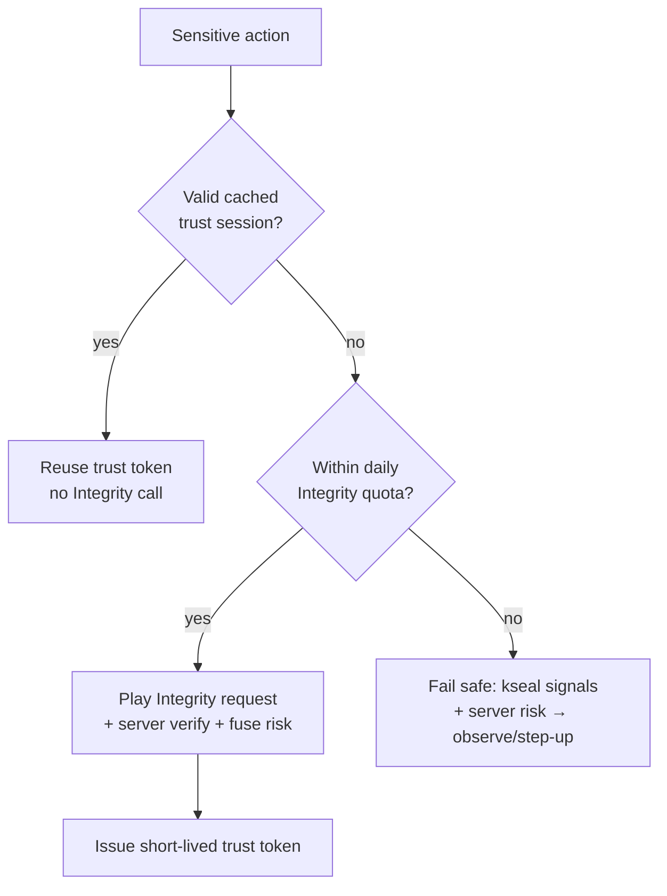

# kseal — Android / Play Store Policy Review

A Phase 0 review confirming the kseal Android SDK complies with **Google Play
program policies** and the **Play Integrity API** operating model. It closes the
**"Play Integrity quota exhaustion"** risk (Medium) and supports the broader
privacy/compliance posture from the
[Risk Assessment](../PROPOSAL.md#risk-assessment).

Complements [Attestation & API Protection](../ARCHITECTURE.md#android--play-integrity-api),
[Privacy Architecture](../ARCHITECTURE.md#privacy-architecture), and the
[MASVS-PLATFORM](masvs-mapping.md#masvs-platform) / [MASVS-PRIVACY](masvs-mapping.md#masvs-privacy)
mappings.

## Table of Contents

- [Why This Matters](#why-this-matters)
- [Play Integrity API Quota Model](#play-integrity-api-quota-model)
- [Quota Budget Math](#quota-budget-math)
- [Standard vs Classic Requests](#standard-vs-classic-requests)
- [No Background Data Collection](#no-background-data-collection)
- [Permissions Model](#permissions-model)
- [Data Safety Section Requirements](#data-safety-section-requirements)
- [Other Play Policy Touchpoints](#other-play-policy-touchpoints)
- [Pre-Submission Checklist](#pre-submission-checklist)

---

## Why This Matters

Like iOS, an Android protection SDK must justify behaviors (integrity checks,
root/emulator detection, anti-tamper) that resemble policy-sensitive activity.
kseal stays compliant because:

- The **authoritative decision is server-side**, so the SDK does not need broad
  permissions or background surveillance.
- Telemetry is **minimized, foreground/event-driven, and free of prohibited
  data** (see [default exclusions](../ARCHITECTURE.md#default-exclusions)),
  keeping the Data Safety declaration small and truthful.
- Attestation is used **only on sensitive actions** with cached trust sessions,
  respecting the Play Integrity quota.

---

## Play Integrity API Quota Model

The Play Integrity API enforces a per-app request budget. The **default quota is
10,000 requests/day** per app, intended to be raised by Google on request for
high-volume apps. kseal's design treats this default as a hard constraint until
an increase is granted.

Design rules (from [Attestation & API Protection](../ARCHITECTURE.md#android--play-integrity-api)):

- **Attest on sensitive actions only** — never per request, never on launch.
- **Cache the trust session** — once a verdict establishes trust, subsequent
  sensitive calls reuse the **short-lived trust token** rather than re-attesting.
- **Request quota increases proactively** for high-volume tenants before they
  approach the ceiling.
- **Fail safe under quota pressure** — if the quota is exhausted, fall back to
  kseal's own signals + server risk fusion (`observe`/`step-up`) rather than
  hard-blocking legitimate users.



---

## Quota Budget Math

Whether 10K/day is sufficient depends entirely on **how often trust must be
re-established**, not on user count — because trust sessions are cached. With a
trust-session TTL of `T` and `S` sensitive sessions per active user per day, the
**attestations per active user per day** is approximately:

```text
attest_per_user_per_day ≈ ceil( active_hours / T_hours )  bounded by  distinct_sensitive_sessions
```

Worked examples (illustrative, default 10K/day quota):

| Trust-session TTL | Attestations / active user / day | Active users supported under 10K/day |
|---|---|---|
| 15 min | ~4 (typical app-usage spread) | ~2,500 |
| 1 hour | ~2 | ~5,000 |
| 4 hours | ~1 | ~10,000 |
| 24 hours | ~1 | ~10,000 |

**Implication:** the default quota only covers a few thousand daily-active users
without an increase, so for any non-trivial tenant kseal **must** (a) cache
aggressively with a sensible TTL, and (b) request a quota increase early. This is
why the architecture mandates attest-on-sensitive-action + caching rather than
naive per-call attestation — a naive design would blow the quota at a few hundred
DAU. Tenants exceeding their granted quota degrade to kseal-signal-only risk
scoring (fail safe), never to user lockout.

---

## Standard vs Classic Requests

The Play Integrity API offers two request types; kseal uses each where it fits:

| Request type | Latency / cost | kseal use |
|---|---|---|
| **Standard request** | Low latency; uses Google-side caching of integrity verdicts; lighter quota impact | Default for most sensitive actions; pairs with kseal's own server nonce for freshness |
| **Classic request** | Higher latency; fresh verdict each call; heavier | Reserved for the highest-value actions (e.g. money movement) where a fresh, uncached verdict is justified |

kseal binds **its own server-issued nonce** into the request so a verdict is tied
to a specific challenge, preventing replay regardless of request type. Re-use of
standard requests where acceptable further protects the quota.

---

## No Background Data Collection

Google Play scrutinizes background activity and prohibits undisclosed background
collection. kseal commits to **no background data collection**:

- **No background services / WorkManager jobs for telemetry.** Probes run
  **only in the foreground**, lazily, and on sensitive actions — consistent with
  [No launch-time network call](../ARCHITECTURE.md#performance-budgets) and
  risk-driven scheduling.
- **No heartbeat / keepalive.** Protection is event-driven, never a fixed
  background ping (see [Cost-control rules](../PROPOSAL.md#unit-economics)).
- **No background location, no geofencing, no passive sensors.**
- **Telemetry is batched and deferred**, sent opportunistically when the app is
  active — not via background sync that would require disclosure and could look
  like surveillance.

This keeps kseal clear of the background-location and background-collection
policy surfaces entirely.

---

## Permissions Model

The SDK is designed to require **no dangerous runtime permissions**. Its signals
come from APIs that need no permission grant.

| Permission class | Requested? | Notes |
|---|---|---|
| `INTERNET` | Yes (normal) | Required to talk to edge/verifier; non-dangerous, auto-granted |
| `ACCESS_NETWORK_STATE` | Optional (normal) | Connectivity/path signals for network-manipulation probe; non-dangerous |
| Location (`ACCESS_*_LOCATION`) | **No** | Excluded by design ([default exclusions](../ARCHITECTURE.md#default-exclusions)) |
| `READ_CONTACTS` / contacts | **No** | Excluded |
| `READ_PHONE_STATE` / IMEI | **No** | No hardware identifiers collected |
| `QUERY_ALL_PACKAGES` | **No** | No installed-app inventory (also a sensitive Play declaration) |
| Advertising ID | **No** | `AD_ID` permission not declared; no ad-ID collection |
| Storage (broad) | **No** | Only the app's own sandbox is read for integrity |
| Accessibility service | **No** | Never used (a high-scrutiny, frequently-abused surface) |

Because the SDK declares **no `AD_ID` permission and no `QUERY_ALL_PACKAGES`**, it
avoids two of the most common Play policy escalations. Root/emulator/hook
detection reads `/proc`, build properties, and loaded libraries — all available
without dangerous permissions.

---

## Data Safety Section Requirements

Every Play app must complete the **Data Safety** form. kseal auto-generates the
tenant's inputs via the
[Google Data Safety helper](../ARCHITECTURE.md#store-compliance) and a
machine-readable SDK data contract. The kseal SDK's contribution to the form:

| Data Safety question | kseal answer | Rationale |
|---|---|---|
| Data collected | Minimal **device-risk signals** (integrity/risk bits, coarse confidence, salted tenant-scoped hashes) | Compact event design; no raw values |
| Data shared with third parties | **No** | Signals go to the tenant's kseal data plane only; no third-party sharing |
| Data used for tracking | **No** | No cross-tenant/cross-app correlation; rotating tenant-scoped IDs |
| Purpose | **Fraud prevention, security, and compliance** | Matches Play's allowed purposes |
| Data linked to identity | **No** | Pseudonymous, tenant-scoped, rotating identifiers; no raw PII |
| Encryption in transit | **Yes** | TLS everywhere |
| Data deletion / retention | Per-region retention; deletion supported | Regional retention controls + data-processing registry |
| Sensitive data (location, contacts, financial) | **None collected** | Excluded by design |

The helper diffs the declared collection against the actual telemetry schema so
the Data Safety form is **truthful and minimal** — an inaccurate declaration is
itself a policy violation, so this automated check is part of the release gate.

---

## Other Play Policy Touchpoints

- **No dynamic code loading.** Config is **signed data interpreted by shipped
  code**, never downloaded executable code — compliant with the Device and
  Network Abuse policy and mirroring the iOS
  [no-dynamic-code](ios-app-review.md#no-dynamic-code-download) stance.
- **Deceptive behavior.** The SDK does not impersonate system UI, does not show
  hidden functionality, and never silently hard-blocks (default `observe →
  step-up`), avoiding the user-frustration patterns Play penalizes.
- **Families / sensitive categories.** No ad-ID and no profiling means kseal is
  safe to embed in Families-program apps.
- **Mobile Unwanted Software (MUwS).** No bundled/undisclosed behavior; the SDK
  does exactly and only what its data contract declares.
- **SDK transparency.** kseal publishes its data contract and behavior, aligning
  with Google's SDK-disclosure expectations.

---

## Pre-Submission Checklist

A release gate (CI-enforceable) before any kseal-protected Android build ships:

- [ ] Manifest declares no dangerous permissions; **no `AD_ID`**, **no
      `QUERY_ALL_PACKAGES`**, no accessibility service.
- [ ] No background services/jobs performing collection; no heartbeat.
- [ ] Play Integrity used on sensitive actions only; trust sessions cached;
      quota-increase requested for the tenant's projected DAU.
- [ ] Fail-safe path verified: quota exhaustion → kseal-signal risk scoring, not
      user lockout.
- [ ] Data Safety inputs generated and **diffed against actual telemetry**; no
      undisclosed collection; "used for tracking = No".
- [ ] No dynamic code download; config channel is signed-data-only.
- [ ] No prohibited data collected (location, contacts, hardware IDs, installed
      apps) per [default exclusions](../ARCHITECTURE.md#default-exclusions).
- [ ] AAR size within the **< 500 KB** budget and startup overhead **< 40 ms
      p95** ([Performance Budgets](../ARCHITECTURE.md#performance-budgets)).

Passing this checklist closes the
[Play Integrity quota exhaustion risk](../PROPOSAL.md#risk-assessment) and
supplies the Android half of the
[MASVS-PLATFORM](masvs-mapping.md#masvs-platform) evidence. See also the
[threat model](threat-model.md) for the threats these controls mitigate.
