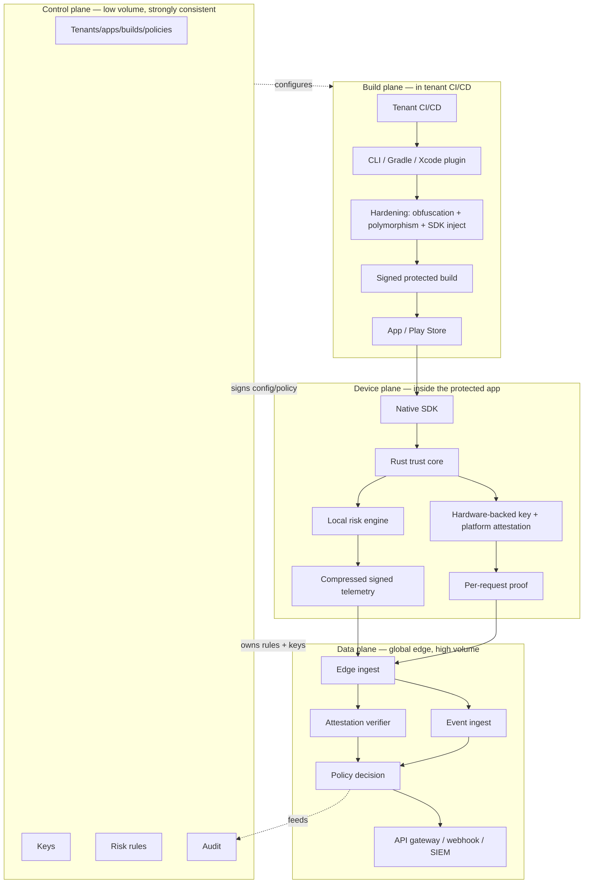

# Chapter 2 — Architecture: the four planes

> **The decision:** How do you split a system that must run *on millions of phones*, *decide
> at high volume*, *harden binaries in customer CI*, and *stay strongly consistent about
> policy and keys* — without any one of those concerns dragging down the others?

---

## The split that makes everything else possible

The single most important architectural call is separating concerns by their **consistency
and volume profile**. Four planes, each with a different job and a different stack:

| Plane | Job | Consistency / volume | Stack in this repo |
|---|---|---|---|
| **Control** | Tenant/app/build registry, policy authoring, key lifecycle, audit, billing | **Strongly consistent, low volume**, owns secrets | Go + Postgres/CockroachDB — `server/control-plane/` |
| **Data** | Edge ingest, attestation verification, trust sessions, risk scoring, fan-out | **Eventually consistent, high volume**, never the source of truth for secrets | Go + Kafka/Redpanda + ClickHouse + Redis — `server/data-plane/` |
| **Build** | Build-time hardening, SDK injection, per-build polymorphism, build proof | Runs **in the tenant's CI**, isolated | Gradle/Xcode plugins + Rust transforms — `plugins/`, `cmd/kseal-cli/` |
| **Device** | RASP probes, crypto binding, local risk engine, telemetry, request proof | Runs **on the user's phone**, resource-constrained | Native Android/iOS + shared Rust core — `sdk/` |

> **The core design principle:** the **control plane** (low-volume, strongly consistent, owns
> secrets and policy) is strictly separated from the **data plane** (high-volume, eventually
> consistent, *never* the source of truth for secrets). Get this boundary wrong and you either
> can't scale (secrets gating every hot-path request) or can't be trusted (high-volume plane
> holding the keys). See [ARCHITECTURE.md](../../ARCHITECTURE.md#core-design-principle).

---

## Why four, not one (or ten)

- **Why not a monolith?** The device plane has a 40 ms startup budget; the data plane handles
  thousands of events/second; the control plane needs ACID guarantees for policy and keys.
  Those are incompatible operating points. Forcing them into one process means one of them
  loses.
- **Why not microservice everything?** Over-decomposition is its own tax — more network hops,
  more failure modes, more ops. For an SME-economics product, ops is the enemy. So the planes
  are the *coarse* boundary; within the data plane, multiple logical services
  (attestation, trust, ingest, query, fleet, canary, webhook, SIEM) live as composable Go
  packages under `server/data-plane/`, not a sprawl of independently deployed services.
- **Why is "build" a plane at all?** Because hardening happens in the *tenant's* CI, on the
  tenant's source, before anything ships. It can't be a server-side service without uploading
  source — a non-starter for many buyers. So build-time work is a plane that runs *outside*
  your infrastructure (see [Chapter 3](03-device-plane-rasp-and-rust-core.md)).

---

## The data flow, end to end

1. **Tenant CI → protected build.** The pipeline invokes the kseal CLI or Gradle/Xcode
   plugin. The compiler applies obfuscation, per-build polymorphism and SDK injection, then
   emits a signed protected build that ships to the store.
2. **Protected app → request proof.** At runtime the native SDK delegates shared logic to the
   Rust trust core, which runs the local risk engine, manages hardware-backed keys and
   platform attestation, emits compressed signed telemetry, and produces a per-request proof.
3. **Global edge → decision.** Telemetry and proofs hit the edge; the attestation verifier and
   event ingest feed a **policy decision** surfaced to the tenant's API gateway, webhooks or
   SIEM.
4. **Control plane → everything.** It owns tenants, apps, builds, policies, keys, rules,
   dashboards, audit and privacy disclosures, and *configures the other three planes* via
   signed config.

The arrows that matter most are the dotted ones: control **signs** what device and data
planes consume. The data plane never invents policy; it executes signed policy. That's what
keeps the high-volume plane honest.

---

## The business read

- **The plane split is what makes "one engineer can operate it" true.** Coarse, well-defined
  boundaries mean fewer moving parts to run, and the expensive-to-operate parts (analytics,
  streaming) are isolated so they can be off-by-default for small tenants.
- **It's also what makes the economics work.** Because secrets and policy live in the
  low-volume control plane and are *signed* for the data plane, you never pay a KMS call per
  request (see [Chapter 8](08-cost-scale-and-noops-economics.md)).
- **It's the deployment story for regulated buyers.** Clean planes let you offer
  private-link, multi-region, and even an air-gapped on-prem *verifier bundle* (`deploy/`)
  without re-architecting — the device and build planes don't change, only where the data
  plane runs.

Next: [Chapter 3 — The device plane](03-device-plane-rasp-and-rust-core.md), where we build
the part that runs on the phone and obsess over the 40 ms budget.
