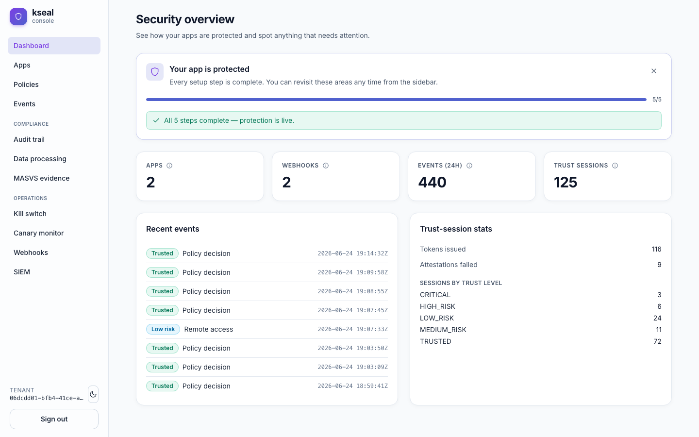

# kseal in the real world — a capability showcase

> A capability showcase built entirely from the **committed [Meridian Pay reference
> dataset](../reference/fixtures/README.md)** — real signed payloads, real risk-scored
> decisions, real control-plane artifacts — and the **measured numbers** in
> [benchmarks](../reference/benchmarks.md). Nothing here is a mockup: every hash, signature,
> score and latency traces back to a committed fixture or a test in the repo, and regenerates
> from a clean checkout.

kseal is a **server-authoritative mobile app-protection and attestation platform** for the
SME segment: teams with millions of installs but **no dedicated security analysts and no ops
budget**. The thesis of this showcase is simple — the capabilities that the top-tier players
(Approov, Guardsquare, Appdome, Promon, Castle, Arkose) charge enterprise money and require
enterprise staffing for, kseal delivers **zero-config, in-product, and operable by one
engineer**.

Rather than walk the feature list, we follow **one company — Meridian Pay — and five of its
teams** doing their actual jobs. Meridian is the canonical reference deployment used across all
kseal docs: tenant `meridian`, apps `pay-android` and `merchant`, regions US/DE/BR/IN/SG, SOC in
Splunk, enforcement mode `STEP_UP`.

---

## The cast — Meridian Pay teams & jobs-to-be-done

| # | Team | Job to be done (JTBD) | kseal capability |
|---|------|------------------------|------------------|
| 1 | **Mobile security** | "Only let *genuine, untampered* app installs move money — and prove every decision to my SOC." | Server-authoritative trust token; risk fusion; signed webhooks; SIEM streaming |
| 2 | **Platform / on-call eng** | "I have no analyst. Tell me automatically when a build is under coordinated attack." | **Fleet Anomaly Guard** — zero-config per-cohort baselines + auto step-up |
| 3 | **Trust & Safety / IR** | "When a compromised build hits, kill it in seconds and keep a tamper-evident record." | Signed remote kill switch; hash-chained audit trail; SIEM |
| 4 | **Compliance / AppSec** | "Prove OWASP-MASVS coverage and document exactly what data we process." | MASVS evidence from build-proof; data-processing registry; audit |
| 5 | **Release engineering** | "Ship a policy change to a slice of traffic with an automatic safety net." | Canary rollout with block-rate guardrail + auto-rollback |

Each chapter's examples are drawn from the five canonical scenarios D1–D5 in
[`scenarios.json`](../reference/fixtures/scenarios.json) and the payload fixtures alongside it.

The console screenshots throughout this series are captured from the kseal console driven by
the canonical Meridian Pay dataset — the same tenant, apps, policies and events the fixtures
describe, seeded by [`examples/meridian-showcase`](../../examples/meridian-showcase) so the
views regenerate from a clean checkout. They reflect the latest UI: Inter typography, the
KChat purple-gradient brand palette, and rounded cards with polished buttons and empty
states.

*The Meridian Pay tenant at a glance: two registered apps, the 24-hour event volume, issued
trust sessions, and the server-derived trust-level distribution — shown in the refreshed
KChat-family console design.*

---

## Why these jobs are hard for the SME segment

The incumbent tools are built for organizations that **already have** a security team:

- **Approov** does excellent runtime attestation, but population-level abuse analytics and
  SIEM correlation are an exercise left to *your* analysts and *your* data pipeline.
- **Guardsquare / Appdome / Promon** are app-hardening powerhouses (obfuscation, RASP), but
  the *server-side trust decision*, *fleet analytics*, *staged rollout* and *compliance
  evidence* are not their job — you assemble those yourself.
- **Castle / Arkose** bring strong population/behavioral abuse detection, but they are
  account-abuse platforms, not mobile attestation + app-integrity + compliance suites, and
  they expect analyst tuning.

The SME doesn't have the people to integrate four products and a data lake. kseal's bet is
**one platform, zero-config defaults, one-engineer operability** — without giving up the
depth that makes the incumbents credible.

---

## What "for real" means here

Everything in the series traces back to committed, reproducible artifacts:

- **One coherent deployment** — Meridian Pay (`tenant=meridian`, apps `pay-android` +
  `merchant`, five regions) — with a real active policy
  ([`control/policy.json`](../reference/fixtures/control/policy.json)) and five end-to-end
  scenarios ([`scenarios.json`](../reference/fixtures/scenarios.json)) spanning every trust
  band from `TRUSTED` (D1) to `CRITICAL` (D3).
- **Real signed payloads**: a golden-vector request proof whose HMAC tag
  (`718bb06d…ebd0d`) is pinned in four source files, a real Ed25519-signed kill switch that
  verifies against a pinned key, and HMAC-signed webhook + Splunk-HEC egress — all in
  [`fixtures/`](../reference/fixtures/README.md).
- **Measured numbers, not adjectives**: device hot-path latency (proof generate ~349 ns, verify
  ~357 ns, policy evaluate ~48 ns, config verify ~54 µs), the Go + Rust test counts that gate
  each capability, and the bottom-up cost model — collected in
  [benchmarks](../reference/benchmarks.md) and [Evidence & back-testing](evidence-and-backtesting.md).

Two real platform defects were found and fixed **because** the docs were grounded in driving the
real product rather than mocking it (see [`defects-found.md`](defects-found.md)).

It all regenerates from a clean checkout with `make test` and `cargo bench`.

---

## The series

1. [Server-authoritative trust — proving every payment comes from a genuine app](01-server-authoritative-trust.md)
2. [Fleet Anomaly Guard — catching a coordinated attack with no analyst](02-fleet-anomaly-guard.md)
3. [Incident response & kill switch — cutting off a bad build in seconds, with receipts](03-incident-response-and-kill-switch.md)
4. [Compliance evidence — turning a build into MASVS proof](04-compliance-evidence.md)
5. [Policy canary rollout — shipping a trust-policy change with a seatbelt](05-policy-canary-rollout.md)

Appendices:
- [Evidence & back-testing](evidence-and-backtesting.md) — the measured numbers behind every chapter
- [Competitive positioning matrix](competitive-matrix.md)
- [Defects found & fixed while making this showcase](defects-found.md)

---

## Want to build one?

This showcase shows kseal *doing the job*. If you want to understand **how it's built** —
the architecture, the trust protocol, the scale and privacy engineering, and the
business decisions behind each choice versus the incumbents — see the companion
[**How to build a continuous app-trust platform**](../build-guide/00-index.md) series.
It's written so a technical *and* a product reader can follow the same thread from "why"
to "how," and rebuild a system like this.
