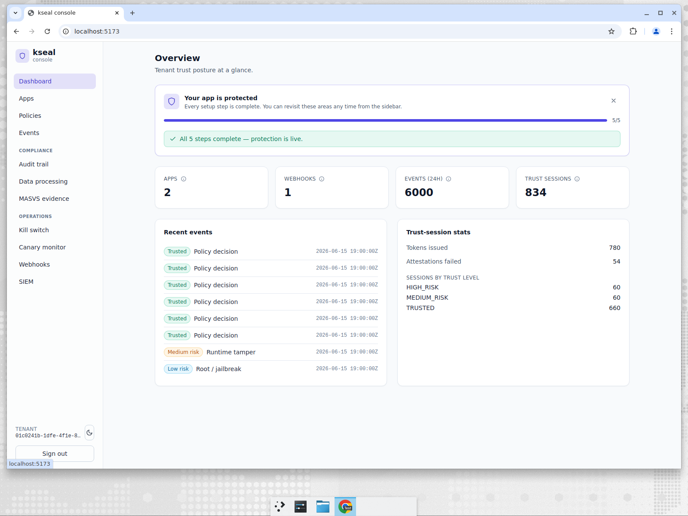
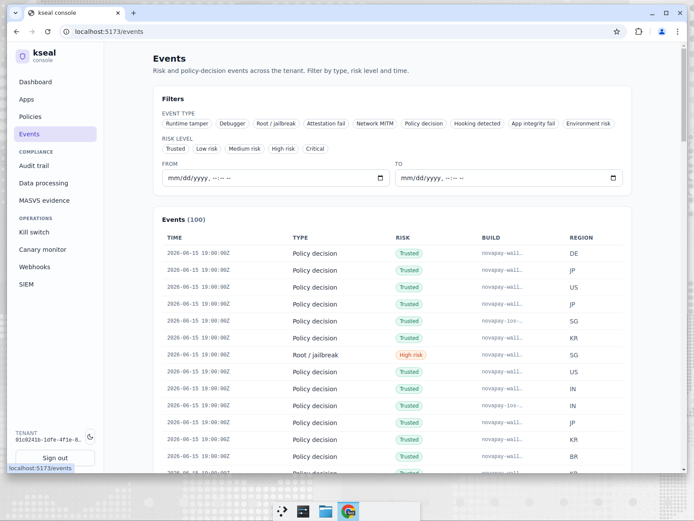
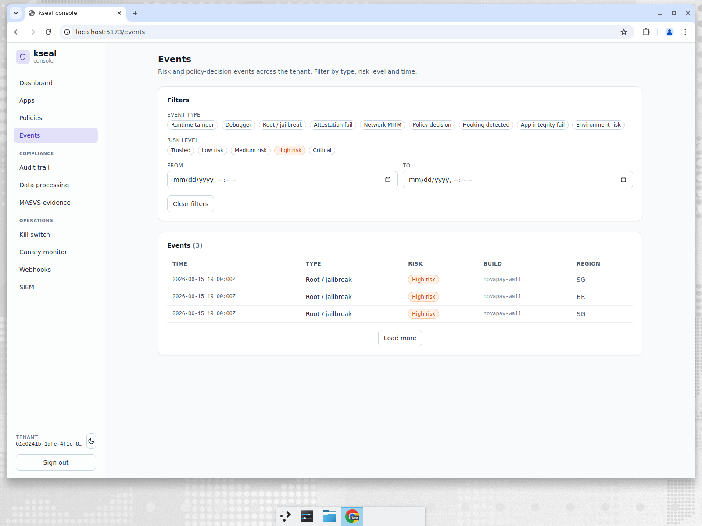
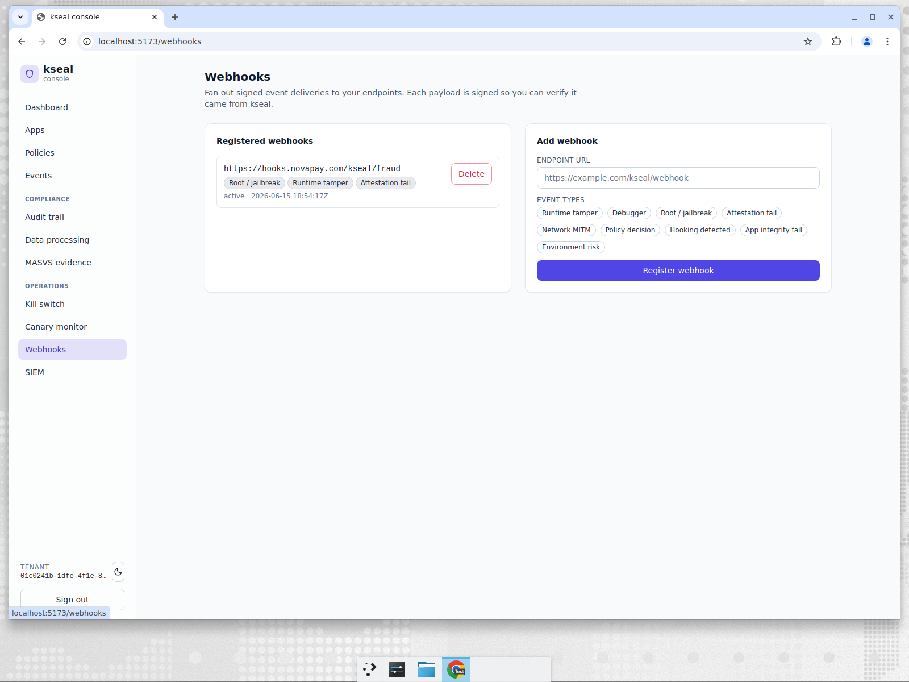
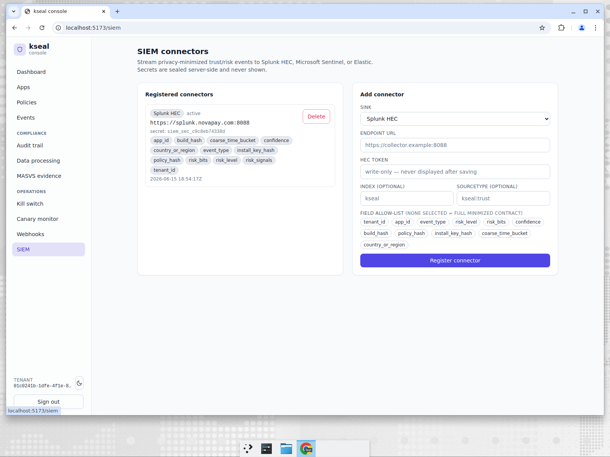

# NovaPay — proving every payment comes from a genuine app

**Company:** NovaPay, a mobile-first payments wallet (Android + iOS), ~12M MAU across DE, JP,
US, SG, KR, IN, BR, GB.
**Persona:** Mobile security lead. Reports to the CISO, owns the mobile trust decision, has
*one* security engineer and a SOC that lives in Splunk.
**Job to be done:** *"Only let genuine, untampered app installs move money — and give my SOC
a defensible record of every decision, without me building a data pipeline."*

---

## The problem

A payments app is the highest-value target on the device. NovaPay needs to know, on every
sensitive action, that the request comes from **their** unmodified app, on a device that
isn't rooted/jailbroken/hooked, and that the platform attestation (Play Integrity / App
Attest) actually checks out. A repackaged APK with a patched balance check, or a hooked
runtime skimming card data, must never receive a trust token.

Crucially, the *decision must be server-authoritative*. If the client decides whether it's
trustworthy, an attacker who owns the client owns the decision.

---

## What NovaPay does in kseal

### 1. One dashboard that says "protection is live"

The overview is the security lead's morning glance: **6,000 events in 24h**, **834 trust
sessions**, **780 tokens issued**, **54 attestations failed**, and the trust-level split
(660 TRUSTED / 60 MEDIUM / 60 HIGH). This is the fused outcome of every attestation — the
device-reported signals **and** the platform attestation verdict, scored server-side against
NovaPay's active policy. The client never gets a vote.

### 2. A global, filterable decision stream

Every policy decision and risk event, across both apps and all eight regions, in one stream:
mostly `Trusted` policy decisions, with the occasional `High risk` root/jailbreak, `Medium
risk` attestation-fail, and `Low risk` MITM/debugger. The build and region columns matter —
they're what let the lead answer *"is this one bad device, or a pattern?"*

When something looks off, one click narrows to exactly the sessions that matter:

Filtered to **High risk**, the noise collapses to three `Root / jailbreak` events in SG and
BR. That's the investigation queue — no query language, no analyst.

### 3. Push the decisions where the SOC already lives

NovaPay's SOC doesn't log into kseal — it lives in Splunk. So kseal **streams to them**, two
ways:

A **signed webhook** to `hooks.novapay.com/kseal/fraud` fires on `root/jailbreak`,
`runtime-tamper` and `attestation-fail`. Each payload is signed so the fraud service can
verify it actually came from kseal — not a spoofed POST.

And a **Splunk HEC connector** streams a privacy-minimized event contract. Note the field
allow-list: alongside `risk_level` and the raw `risk_bits` integer, kseal emits
**`risk_signals`** — *named* per-signal fields (e.g. `app_tamper`, `debugger`) so the SOC's
correlation rules never depend on fragile numeric bit positions. The HEC token is
**write-only — sealed server-side and never shown again**. No data lake to build; the
contract is minimized by default.

---

## How the incumbents handle this

| Capability | kseal | Approov | Guardsquare/Appdome | Castle/Arkose |
|---|---|---|---|---|
| Server-authoritative trust token bound to instance+build+risk+nonce+policy | **Built-in** | Token-based, strong | Not the product (hardening focus) | Account-abuse focus, not app attestation |
| Fuse device signals **and** platform attestation server-side | **Built-in** | Partial (attestation-centric) | DIY | DIY |
| Global decision stream + one-click risk triage in-product | **Built-in** | DIY dashboards | Limited | Yes (analyst-oriented) |
| Signed webhooks + SIEM with **named** (not numeric) signals & sealed secrets | **Built-in** | DIY | DIY | Partial |

The incumbents are strong at their core, but a NovaPay-sized team would be **integrating
three of them plus a pipeline** to land where kseal starts.

---

## Why it wins for NovaPay

- **No data engineering.** The SOC gets signed webhooks and a minimized SIEM stream out of
  the box, with named signals that won't break when bit layouts evolve.
- **No analyst required to triage.** Risk bands and one-click filters replace a query
  language.
- **Defensible by construction.** The decision is server-side, bound to a nonce and the
  exact policy hash, and every control-plane change is independently audit-verifiable
  (see the [GameForge](03-gameforge-incident-response.md) and
  [MediToken](04-meditoken-compliance.md) chapters).

> JTBD met: *genuine app installs move money, and every decision is provable to the SOC —
> with one engineer and zero pipeline.*
