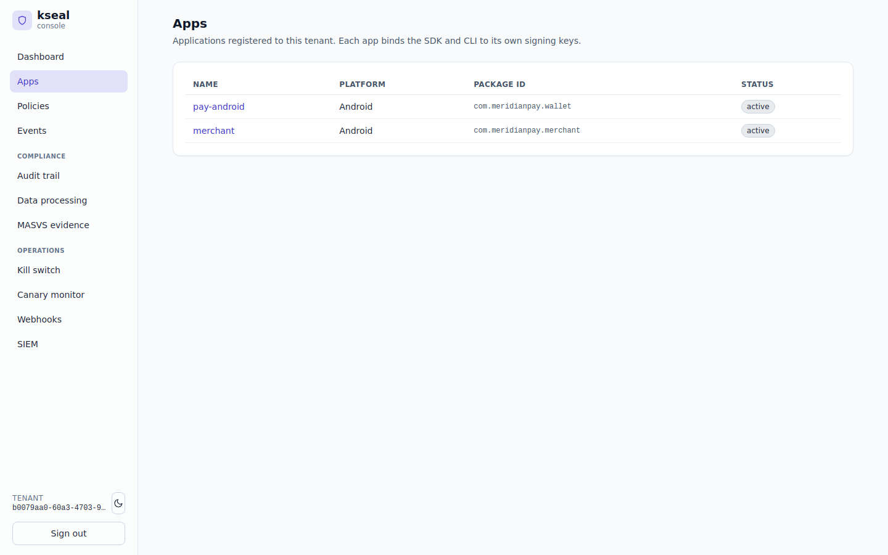
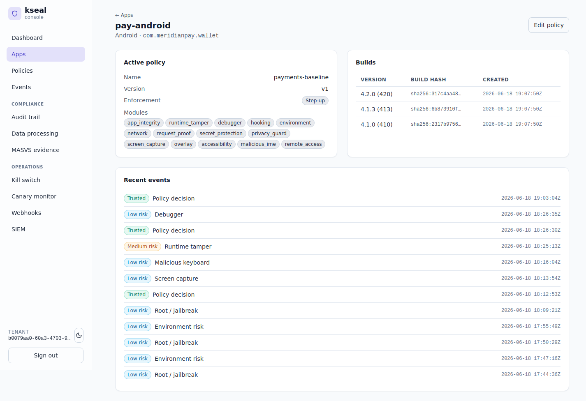
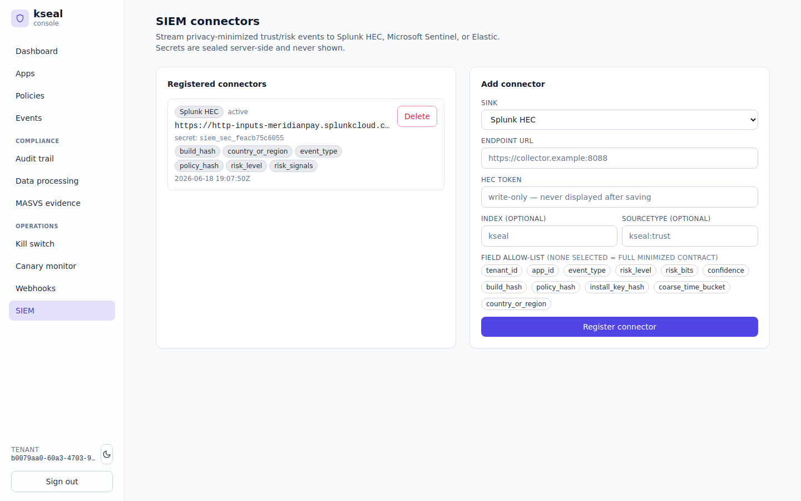
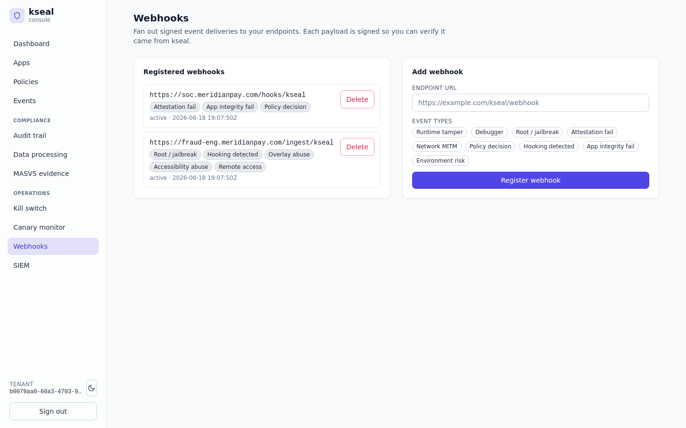

# Server-authoritative trust — proving every payment comes from a genuine app

**Meridian Pay team:** Mobile security. Reports to the CISO, owns the mobile trust
decision, runs with *one* security engineer and a SOC that lives in Splunk.
**Job to be done:** *"Only let genuine, untampered app installs move money — and give my SOC
a defensible record of every decision, without me building a data pipeline."*

The deployment these examples run against is the canonical
[Meridian Pay reference](../reference/fixtures/README.md): tenant `meridian`, apps
`pay-android` and `merchant`, regions US/DE/BR/IN/SG, enforcement mode `STEP_UP`.

---

## The problem

A payments app is the highest-value target on the device. Meridian Pay needs to know, on
every sensitive action, that the request comes from **their** unmodified app, on a device
that isn't rooted/jailbroken/hooked, and that the platform attestation (Play Integrity / App
Attest) actually checks out. A repackaged APK with a patched balance check, or a hooked
runtime skimming card data, must never receive a trust token.

Crucially, the *decision must be server-authoritative*. If the client decides whether it's
trustworthy, an attacker who owns the client owns the decision.

---

## What the mobile-security team does in kseal

Both of Meridian's apps are registered to the one tenant, each binding its SDK and CLI to its
own signing keys:


*`pay-android` (`com.meridianpay.wallet`) and `merchant` (`com.meridianpay.merchant`), both
active under tenant `meridian`.*

### 1. A genuine install gets a short-lived trust token

When a stock device on a registered build asks to be trusted, the control plane verifies the
platform attestation, fuses it with the device-reported signals, scores the result, and
mints a token. This is scenario **D1** in
[`scenarios.json`](../reference/fixtures/scenarios.json), captured as the real
`VerifyAttestation` exchange in
[`trust/attestation-verdict.json`](../reference/fixtures/trust/attestation-verdict.json):

```json
"verdict":  { "integrity_verdict": "MEETS_DEVICE_INTEGRITY", "build_recognized": true },
"response": { "trust_level": "TRUST_LEVEL_TRUSTED", "score": 0, "ttl_seconds": 300 }
```

A recognized, integral device on a registered `build_hash` with no reported risk bits scores
**0 → TRUSTED**, and the token expires in 300 s. Trust is never permanent; it is re-earned.

### 2. Every sensitive request carries a proof the server can check

The token alone isn't enough — each call to the payments backend carries a per-request HMAC
proof bound to the request, a monotonic sequence number, and the server nonce. The device
and the server independently reconstruct the same preimage and tag, so the per-install key
**never leaves the device**. This is the golden vector in
[`trust/request-proof.json`](../reference/fixtures/trust/request-proof.json), pinned
byte-for-byte in four source files:

```json
"header":         "X-Kseal-Proof: <token_id>.<sequence>.<tag_hex>",
"expected_tag_hex": "718bb06df45dc4bbc5bf483bd65acf7609429966adba8baff66fa965857ebd0d",
"replay_defense": "sequence is strictly monotonic per trust token; the server rejects any non-increasing sequence"
```

### 3. A repackaged build cannot talk its way to a decision

The headline property is what happens when the client is hostile. Scenario **D3** is a
repackaged build on a phone whose on-device self-integrity has fired; platform attestation
also fails server-side
([`trust/trust-decision.json`](../reference/fixtures/trust/trust-decision.json)):

```
device wire bits → app_tamper (60)        # the client could lie and report 0 here
attestation      → attestation_fail (70)  # server-derived; the client cannot suppress it
fused score      = 130  → CRITICAL → DENY
```

> *"Even though a repackaged app could patch its local SDK to report `risk_bits=0`, it cannot
> suppress the server-derived `attestation_fail`, and it cannot mint a server-accepted
> decision."* — `trust/trust-decision.json`

A single device-side bit (tamper, 60) is only `MEDIUM_RISK` on its own. It is the **fusion**
with the server-side attestation failure that crosses `CRITICAL` and denies the payment.
That is the server-authoritative property in one number.

The console's per-app view shows `pay-android`'s active policy, its recognized builds, and the
live event stream those decisions land in — including the `Runtime tamper` and `Policy
decision` events behind this scenario:


*`pay-android`: the active `payments-baseline` policy (Step-up), three registered builds, and
recent events from `Policy decision` down to `Runtime tamper`, `Malicious keyboard` and
`Root / jailbreak`.*

### 4. Push the decisions where the SOC already lives

The SOC doesn't log into kseal — it lives in Splunk. So kseal **streams to it**, two ways,
from the same decision. The D3 CRITICAL decision leaves as a signed webhook
([`egress/webhook-delivery.json`](../reference/fixtures/egress/webhook-delivery.json)) and
as a Splunk HEC event
([`egress/siem-event.json`](../reference/fixtures/egress/siem-event.json)) — **byte-identical
record, two transports**:

```json
"X-Kseal-Signature": "0cf916c4…267bd2",   // HMAC-SHA256(secret, the exact 524-byte body)
"event": {
  "risk_level": "TRUST_LEVEL_CRITICAL",
  "risk_signals": ["app_tamper", "attestation_fail"],   // NAMED, not a raw bit integer
  "build_hash": "e3bb7952…a70d73", "policy_hash": "62fdc9b7…f508c34"
}
```

Two details that matter to the SOC: the egress carries **named** `risk_signals` alongside the
raw integer, so correlation rules never depend on fragile numeric bit positions; and the HEC
token is held server-side and **never appears in telemetry**. There is no data lake to build —
the contract is minimized by default and the webhook signature is verifiable, so a spoofed
POST can't impersonate kseal.

Both transports are registered and managed in the console, with the secret sealed server-side
and a field allow-list that enforces the minimized contract:


*Meridian's Splunk HEC connector: active, secret sealed server-side, with the minimized field
allow-list (`build_hash`, `country_or_region`, `event_type`, `policy_hash`, `risk_level`,
`risk_signals`).*


*The same decisions also leave as signed webhooks to Meridian's SOC and fraud-engineering
endpoints, each filtered to the event types that endpoint cares about.*

---

## How the incumbents handle this

| Capability | kseal | Approov | Guardsquare/Appdome | Castle/Arkose |
|---|---|---|---|---|
| Server-authoritative trust token bound to instance+build+risk+nonce+policy | **Built-in** | Token-based, strong | Not the product (hardening focus) | Account-abuse focus, not app attestation |
| Fuse device signals **and** platform attestation server-side | **Built-in** | Partial (attestation-centric) | DIY | DIY |
| Global decision stream + one-click risk triage in-product | **Built-in** | DIY dashboards | Limited | Yes (analyst-oriented) |
| Signed webhooks + SIEM with **named** (not numeric) signals & sealed secrets | **Built-in** | DIY | DIY | Partial |

The incumbents are strong at their core, but a one-engineer team would be **integrating three
of them plus a pipeline** to land where kseal starts.

---

## Back-tested evidence

The trust decision isn't a mock-up — it's a measured, tested protocol (full numbers in
[Evidence & back-testing](evidence-and-backtesting.md), perf in
[benchmarks](../reference/benchmarks.md)):

- **The chain is proven both ways.** `e2e_trust_flow_test.go` drives the real challenge →
  attest → token → signed-proof flow and asserts that a **replayed proof, a decreasing
  sequence number, the wrong nonce, the wrong token, or the wrong key all return DENY**.
  Owning the client doesn't let you mint trust.
- **It's effectively free on the hot path.** A per-request HMAC proof generates in
  **~349 ns** and verifies in **~357 ns**; policy evaluation is **~48 ns**. The payment flow
  pays no perceptible latency tax for being attested.
- **The SOC contract is minimized by construction.** `privacy_contract_test.go` asserts the
  telemetry schema carries only non-PII fields, and the SIEM egress emits **named**
  `risk_signals` — so correlation rules don't break when the bit layout evolves. The HEC
  token is sealed server-side.

---

## Why it wins for the mobile-security team

- **No data engineering.** The SOC gets signed webhooks and a minimized SIEM stream out of
  the box, with named signals that won't break when bit layouts evolve.
- **No analyst required to triage.** Risk bands and one-click filters replace a query
  language.
- **Defensible by construction.** The decision is server-side, bound to a nonce and the
  exact `policy_hash`, and every control-plane change is independently audit-verifiable
  (see the [incident-response](03-incident-response-and-kill-switch.md) and
  [compliance](04-compliance-evidence.md) chapters).

> JTBD met: *genuine app installs move money, and every decision is provable to the SOC —
> with one engineer and zero pipeline.*
