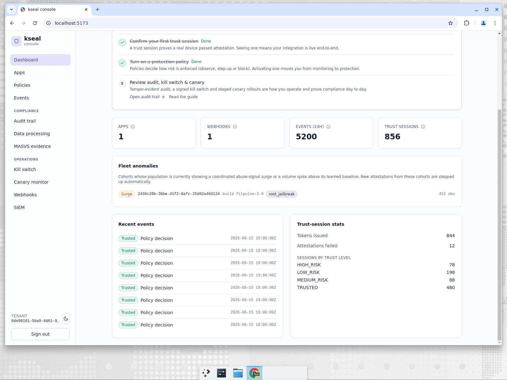

# FitPulse — the NoOps founder who gets an analyst for free

**Company:** FitPulse, a consumer fitness app. One Android app, growing fast.
**Persona:** Solo founder who also happens to be the only engineer. No security team, no SOC,
no analyst, no on-call ops rotation.
**Job to be done:** *"I will never sit and watch a dashboard. Tell me **automatically** when
a build of my app is under coordinated attack, and do something about it without paging me."*

---

## The problem

This is the depth gap that separates "a dashboard" from "a product that protects you."

Per-instance attestation answers *"is this one device trustworthy?"* — but it is **blind to
the population**. A device that self-reports clean and passes platform attestation is judged
in isolation, even if 10,000 sibling installs on the same build just lit up with
root/jailbreak signals from one corner of the fleet in five minutes. That coordinated
pattern — a freshly cracked build, a farm spinning up, an abuse kit going live — is exactly
what enterprise teams pay analysts to spot.

FitPulse has no analyst. So the platform has to be the analyst.

---

## What FitPulse does in kseal: *nothing* — and that's the point

Fleet Anomaly Guard is **zero-config**. There are no baselines to define, no thresholds to
tune, no cohorts to declare. The engine continuously learns each app's normal prevalence of
abuse signals, scoped per **(tenant, app, build, region)** cohort, and watches for two kinds
of break:

- a **per-signal surge** (e.g. `root_jailbreak` prevalence spiking far above the cohort's
  learned baseline), and
- a **volume-velocity spike** (a cohort's attestation volume exploding above baseline — which
  catches a coordinated flood even when every individual client looks clean).

When a cohort breaks, kseal fuses a server-derived `FLEET_ANOMALY` risk bit into **newly
arriving** attestations for that cohort — a graduated **auto step-up**, not a blunt block, so
legitimate users in a hot cohort aren't locked out.

Here it is firing live. We drove a coordinated surge of 320+ root-signal attestations against
the `fitpulse-3.9` build in a five-minute window:

The **Fleet anomalies** panel surfaces the cohort with a `Surge` badge: build
**`fitpulse-3.9`**, signal **`root_jailbreak`**, **422 observations**. The panel's own
description states the contract plainly: *"New attestations from these cohorts are stepped up
automatically."* The founder did not configure this, was not paged, and the abuse wave is
already being met with elevated friction.

The design is built for the SME-at-scale economics that make this affordable:

- **O(1) per event**, in-process — no extra service to run.
- **Bounded memory** via sharded, LRU-evicted cohort state — fits 5,000 tenants × millions of
  apps × tens of millions of MAU without a per-cohort cost explosion.
- **Aggregates only** — no new per-user identifiers are introduced to do population
  detection, so it doesn't create a privacy liability.
- **Secure-by-default cohorting** — region is only trusted from edge headers when the operator
  explicitly opts in, so an attacker hitting the server directly can't fabricate per-request
  cohorts to slip under the baseline.

---

## How the incumbents handle this

| Capability | kseal | Approov | Castle / Arkose | Guardsquare/Appdome |
|---|---|---|---|---|
| Population/fleet-level coordinated-abuse detection | **Built-in, zero-config** | Not the core model (per-instance attestation) | **Strong** — but analyst-tuned, account-abuse oriented | Not the product |
| Per-(build, region) cohort baselines learned automatically | **Yes** | No | Configurable, expects tuning | No |
| Volume-velocity spike detection (clean-looking flood) | **Yes** | No | Yes | No |
| Graduated auto step-up vs. hard block | **Yes** | Manual policy | Yes | N/A |
| Runs with **no analyst and no extra service** | **Yes** | Yes (but no fleet analytics) | No (analyst-oriented) | Yes |

Castle and Arkose are genuinely strong at population abuse detection — that's their
specialty. But they are account-abuse platforms that **expect an analyst** to tune and
operate them, and they don't also give FitPulse mobile attestation, app-integrity, kill
switch and compliance evidence in the same product. For a solo founder, "buy Arkose and hire
an analyst" is not an answer.

---

## Why it wins for FitPulse

- **It's the analyst FitPulse can't hire.** Coordinated attacks get caught and answered
  automatically.
- **Zero-config or it doesn't count.** A NoOps founder will never tune baselines; kseal
  learns them.
- **It scales economically.** O(1)/event and bounded memory mean the feature costs cents at
  millions of MAU, not an enterprise contract.

> JTBD met: *the founder is told — and protected — automatically when a build is under
> coordinated attack, without ever watching a dashboard.*
