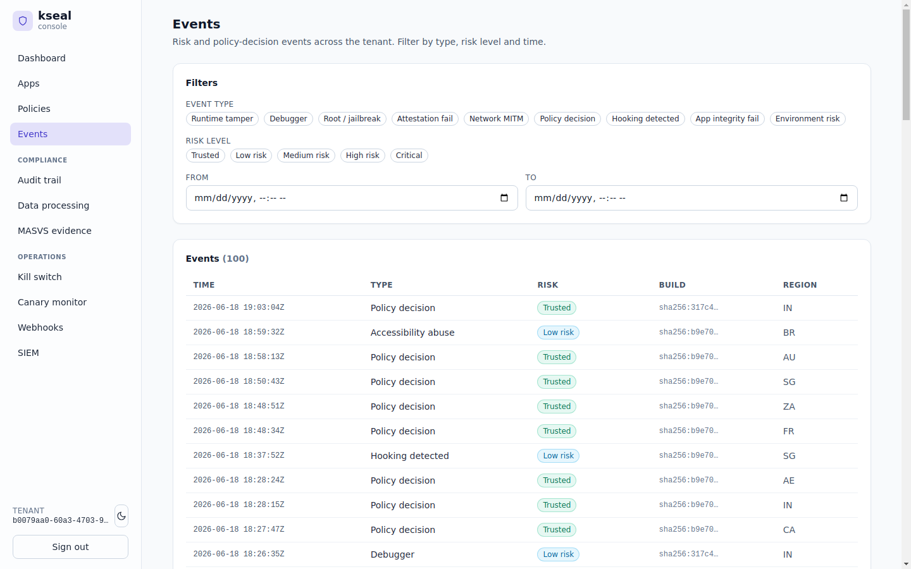

# Fleet Anomaly Guard — catching a coordinated attack with no analyst

**Meridian Pay team:** Platform / on-call engineering. A small team that keeps the apps
running; no dedicated fraud analyst sitting in front of a dashboard.
**Job to be done:** *"Never make me watch a dashboard. Tell me **automatically** when a build
is under coordinated attack, and do something about it without paging me."*

The deployment is the canonical [Meridian Pay reference](../reference/fixtures/README.md):
tenant `meridian`, apps `pay-android` and `merchant`, regions US/DE/BR/IN/SG.

---

## The problem

This is the depth gap that separates "a dashboard" from "a product that protects you."

Per-instance attestation answers *"is this one device trustworthy?"* — but it is **blind to
the population**. A device that self-reports clean and passes platform attestation is judged
in isolation, even if 10,000 sibling installs on the same build just lit up with
root/jailbreak signals from one corner of the fleet in five minutes. That coordinated
pattern — a freshly cracked build, a farm spinning up, an abuse kit going live — is exactly
what enterprise teams pay analysts to spot.

Meridian Pay's on-call rotation has no analyst for this. So the platform has to be the
analyst.

---

## What the platform team does in kseal: *nothing* — and that's the point

Fleet Anomaly Guard is **zero-config**. There are no baselines to define, no thresholds to
tune, no cohorts to declare. The engine continuously learns each app's normal prevalence of
abuse signals, scoped per **(tenant, app, build, region)** cohort, and watches for two kinds
of break:

- a **per-signal surge** (e.g. `root_jailbreak` prevalence spiking far above the cohort's
  learned baseline), and
- a **volume-velocity spike** (a cohort's attestation volume exploding above baseline — which
  catches a coordinated flood even when every individual client looks clean).

When a cohort breaks, kseal fuses the server-derived `FLEET_ANOMALY` bit into **newly
arriving** attestations for that cohort. That bit sits at position **32** — well clear of the
device wire range (0–20), because a device can never report it — and carries a default weight
of **50** (see [risk-signals](../reference/risk-signals.md)). The effect is a graduated
**auto step-up**, not a blunt block:

```
a device that self-reports clean      → score 0   → TRUSTED → allow
the same device in a flagged cohort   → +FLEET_ANOMALY (50) → MEDIUM_RISK → step-up
```

So a coordinated wave is met with elevated friction *for that cohort* while legitimate users
keep working — no one is locked out, and the on-call engineer is neither paged nor asked to
configure anything.

The raw material the guard learns from is the per-event signal population the console already
shows — every event carries the `build` and `region` that define its cohort, so a surge of one
signal in one `(build, region)` slice is exactly what the engine watches for:


*The tenant-wide event stream: each row carries its risk band, the `build` it was scored
against, and the `region` it came from — the per-cohort dimensions Fleet Anomaly Guard
baselines automatically.*

The design is built for the SME-at-scale economics that make this affordable:

- **O(1) per event**, in-process — no extra service to run.
- **Bounded memory** via sharded, LRU-evicted cohort state — fits thousands of tenants ×
  millions of apps × tens of millions of MAU without a per-cohort cost explosion.
- **Aggregates only** — no new per-user identifiers are introduced to do population
  detection, so it doesn't create a privacy liability.
- **Secure-by-default cohorting** — region is only trusted from edge headers when the operator
  explicitly opts in, so an attacker hitting the server directly can't fabricate per-request
  cohorts to slip under the baseline.

---

## How the incumbents handle this

| Capability | kseal | Approov | Castle / Arkose | Guardsquare/Appdome |
|---|---|---|---|---|
| Population/fleet-level coordinated-abuse detection | **Built-in, zero-config** | Not the core model (per-instance attestation) | **Strong** — but analyst-tuned, account-abuse oriented | Not the product |
| Per-(build, region) cohort baselines learned automatically | **Yes** | No | Configurable, expects tuning | No |
| Volume-velocity spike detection (clean-looking flood) | **Yes** | No | Yes | No |
| Graduated auto step-up vs. hard block | **Yes** | Manual policy | Yes | N/A |
| Runs with **no analyst and no extra service** | **Yes** | Yes (but no fleet analytics) | No (analyst-oriented) | Yes |

Castle and Arkose are genuinely strong at population abuse detection — that's their
specialty. But they are account-abuse platforms that **expect an analyst** to tune and
operate them, and they don't also give Meridian Pay mobile attestation, app-integrity, kill
switch and compliance evidence in the same product. For a lean platform team, "buy Arkose and
hire an analyst" is not an answer.

---

## Back-tested evidence

The behaviour is a unit test, not a one-off demo (full numbers in
[Evidence & back-testing](evidence-and-backtesting.md)):

- **Learn the baseline, then catch the surge.** `TestBaselineLearnThenSurge` in
  `server/data-plane/fleet/engine_test.go` learns a clean baseline for a cohort, replays a
  coordinated `root_jailbreak` surge, and asserts the cohort breaks with a `Surge` verdict and
  begins auto-stepping-up new attestations — while `TestUnobservedScopeIsClean` proves it
  *won't* fire on quiet cohorts (no false alarms).
- **It costs cents, not an analyst's salary.** Detection is **O(1) per event**, in-process,
  with bounded memory via sharded LRU cohort state — so it rides the same
  **~$585/mo-at-100M-MAU** data-plane envelope from the [cost model](../cost-model.md) instead
  of an enterprise abuse-detection contract.
- **No privacy debt.** The engine works on **aggregates only** — it introduces no new per-user
  identifier to do population detection, which is what `privacy_contract_test.go` guards.

---

## Why it wins for the platform team

- **It's the analyst they can't hire.** Coordinated attacks get caught and answered
  automatically.
- **Zero-config or it doesn't count.** A lean team will never tune baselines; kseal learns
  them.
- **It scales economically.** O(1)/event and bounded memory mean the feature costs cents at
  millions of MAU, not an enterprise contract.

> JTBD met: *the team is told — and protected — automatically when a build is under
> coordinated attack, without ever watching a dashboard.*
