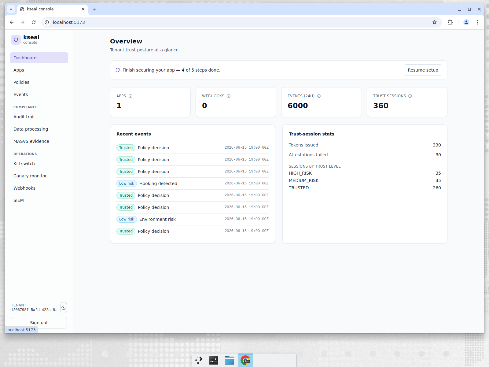
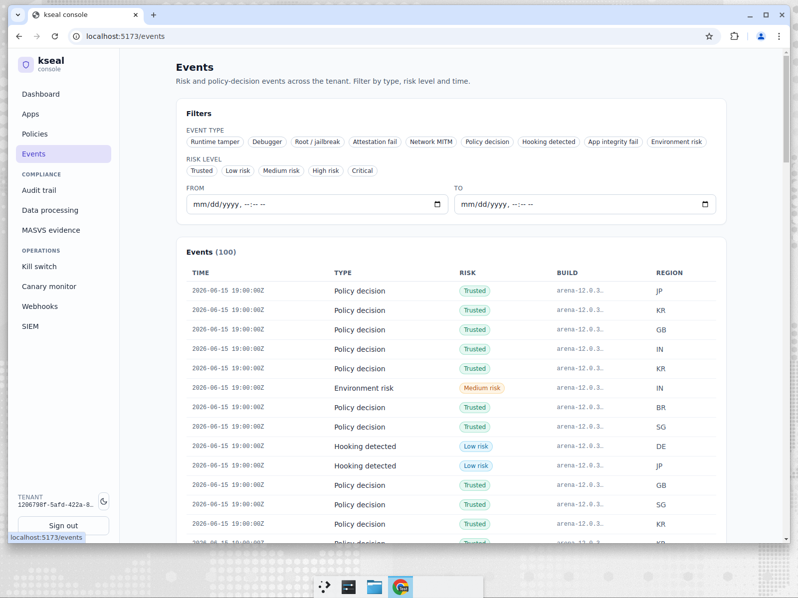
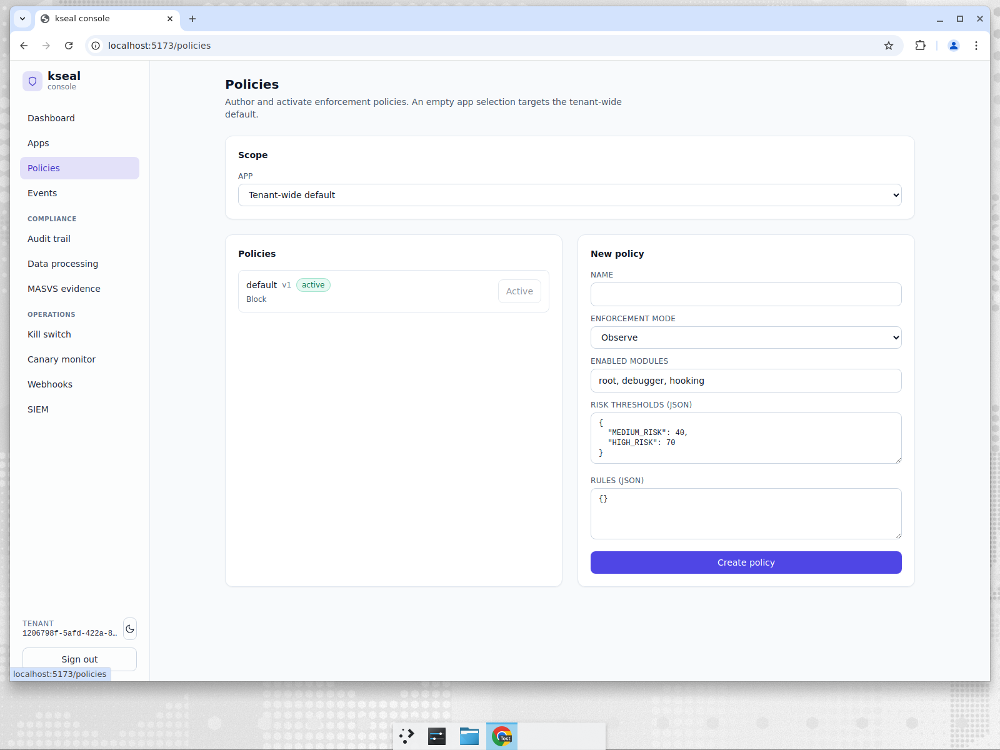
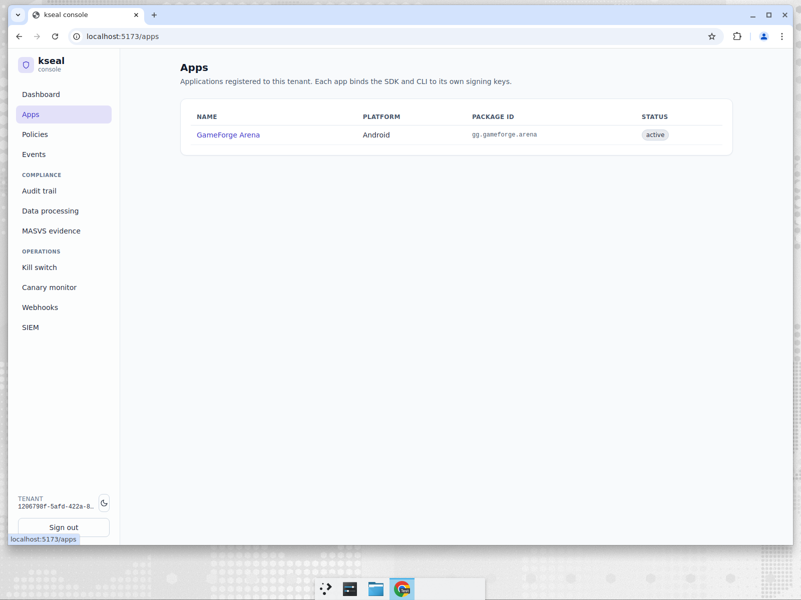
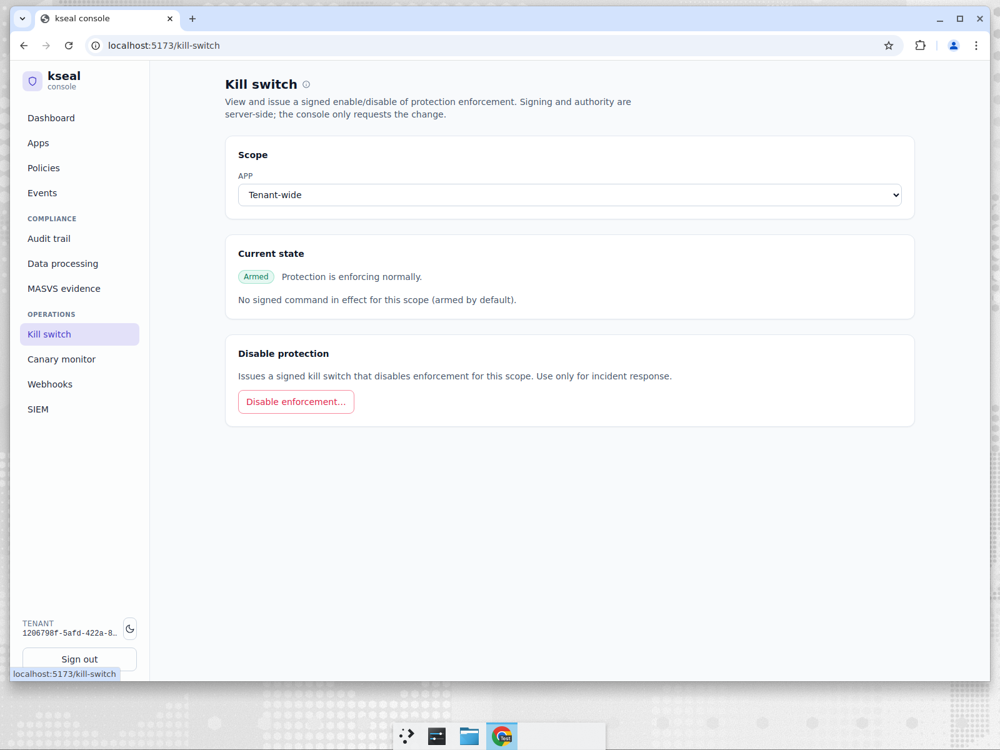
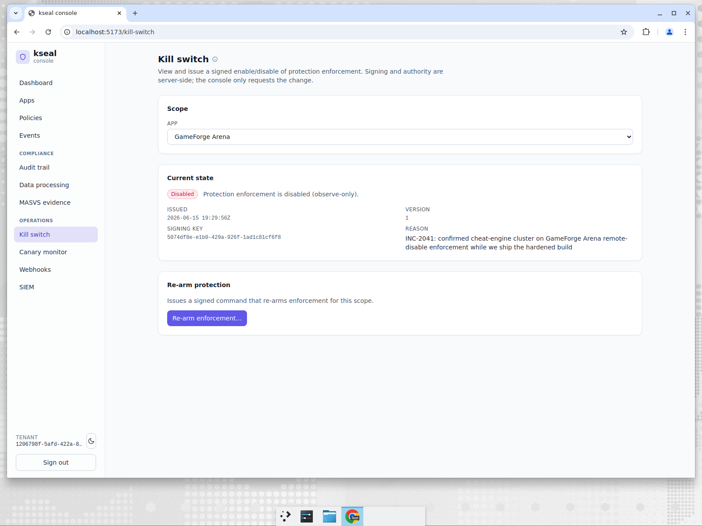
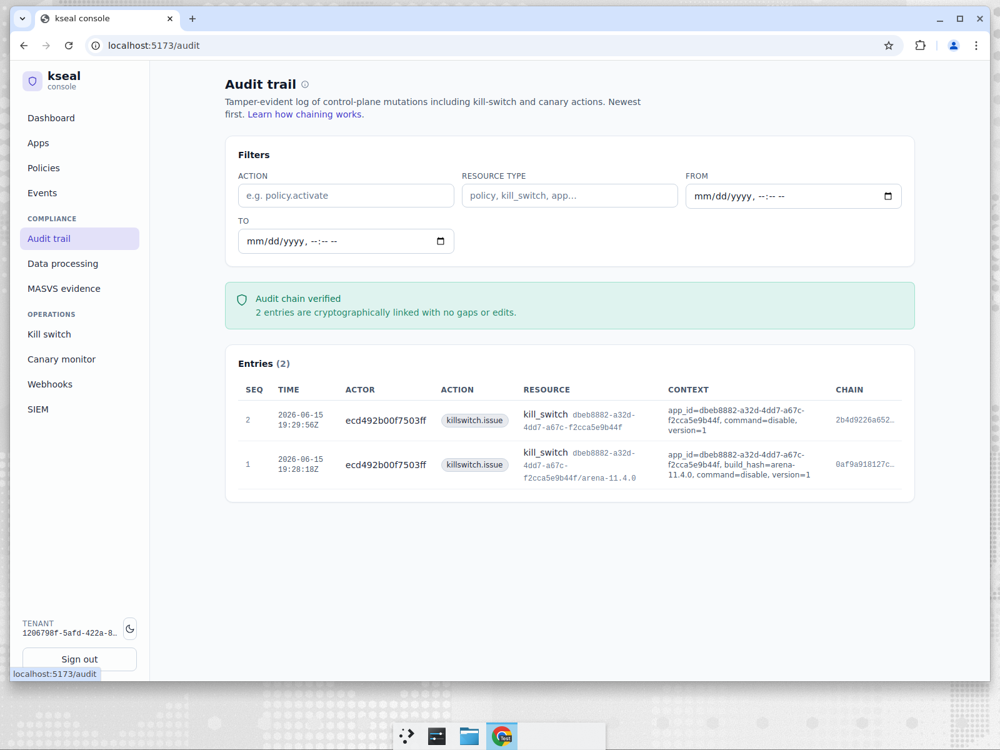
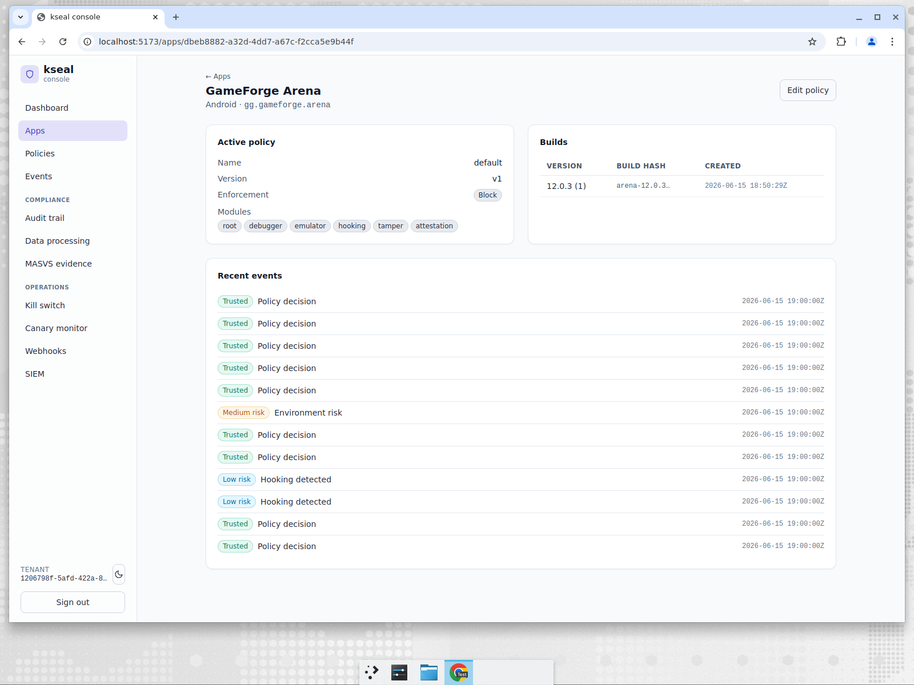
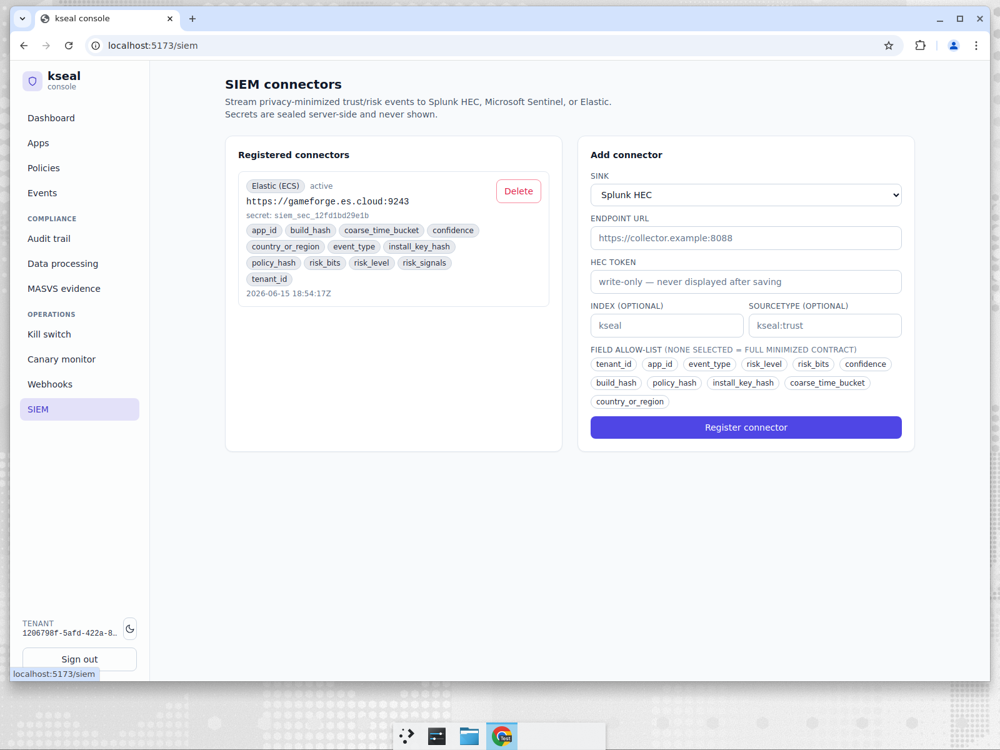

# GameForge — killing an abuse wave in seconds, with receipts

**Company:** GameForge, a mobile game studio. Cheating, bot farms and modded clients are a
daily reality.
**Persona:** Trust & Safety lead doubling as the SOC. Needs to act fast during an incident
and answer to anti-cheat partners and platform stores afterward.
**Job to be done:** *"When a modded-client or abuse wave hits, I need to cut it off in
seconds — and I need a tamper-evident record that proves exactly what I did and when."*

---

## The problem

In gaming, abuse is constant and fast-moving. When a cracked client starts handing out an
unfair advantage, every minute of delay is lost revenue and churned legitimate players. The
T&S lead needs a **big red button** that takes effect immediately and globally — but a big
red button with no audit trail is its own liability. After the incident, partners and stores
will ask: *who flipped it, when, and can you prove the record wasn't edited?*

---

## What GameForge does in kseal

### The day-to-day posture

The overview shows GameForge's live posture — apps, webhooks, events in the last 24h and
trust sessions — with the onboarding fully complete and protection live.

The event stream is where abuse patterns first show up — emulator, hooking, root and
tamper signals across builds and regions.

The active policy defines how risk is enforced — the risk thresholds and module set that turn
fused signals into observe / step-up / block decisions.

The app inventory and per-app build registry — the builds whose `build_hash` anchors every
trust decision and every piece of compliance evidence.

### The incident: arm the kill switch

When an abuse wave hits, the T&S lead arms the **signed remote kill switch**:

The kill switch is **cryptographically signed** — clients verify the signature before
honoring it, so an attacker can't forge a "stand down" or replay an old state. It takes
effect on the next attestation, globally, in seconds.

Once the bad build is contained, it's disabled just as cleanly:

### The receipts: a hash-chained audit trail

Every one of those actions is written to a **tamper-evident, hash-chained audit log** — and
the console *independently verifies the chain* on load:

The banner reads **"Audit chain verified — entries are cryptographically linked with no gaps
or edits."** Each entry carries the actor, action, resource and the chain hash linking it to
the previous entry. If anyone tampered with or deleted a row, the chain would break and the
console would say so. That's the difference between "a log" and "evidence."

Drilling into a single app shows the build-level detail behind those decisions:

And the same events stream to GameForge's SIEM for long-term correlation:

---

## How the incumbents handle this

| Capability | kseal | Approov | Guardsquare/Appdome | Castle/Arkose |
|---|---|---|---|---|
| Signed, client-verifiable remote kill switch | **Built-in** | Token/rotation controls | App-side controls vary | N/A |
| Takes effect globally in seconds on next attestation | **Yes** | Yes | Varies | N/A |
| **Hash-chained, console-verified** audit of every mutation | **Built-in** | DIY / external logging | DIY | Partial |
| SIEM streaming of the same events | **Built-in** | DIY | DIY | Partial |

The kill capability exists in various forms across the incumbents, but the **tamper-evident,
self-verifying audit trail** — the part that turns an action into *defensible evidence* — is
typically something a customer is expected to build with external logging infrastructure.

---

## Why it wins for GameForge

- **Speed with safety.** A signed kill switch that clients can't forge, effective globally in
  seconds.
- **Receipts by default.** The hash-chained audit isn't a feature you enable — it's how every
  mutation is recorded, and the console proves the chain is intact.
- **One product.** Detection, response and the evidentiary record live together, so the T&S
  lead isn't stitching tools during an incident.

> JTBD met: *cut off the abuse wave in seconds, and walk into the post-incident review with a
> cryptographically verifiable record of exactly what happened.*
