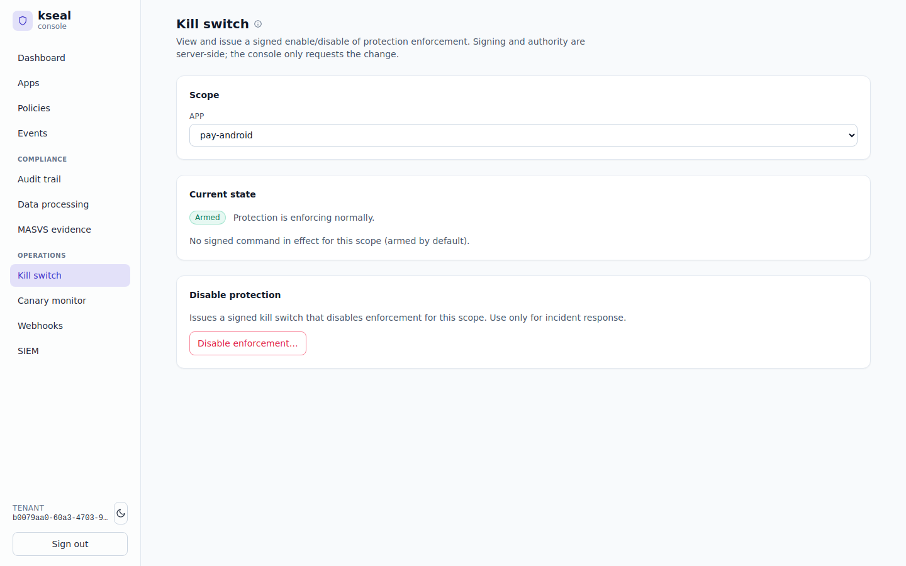
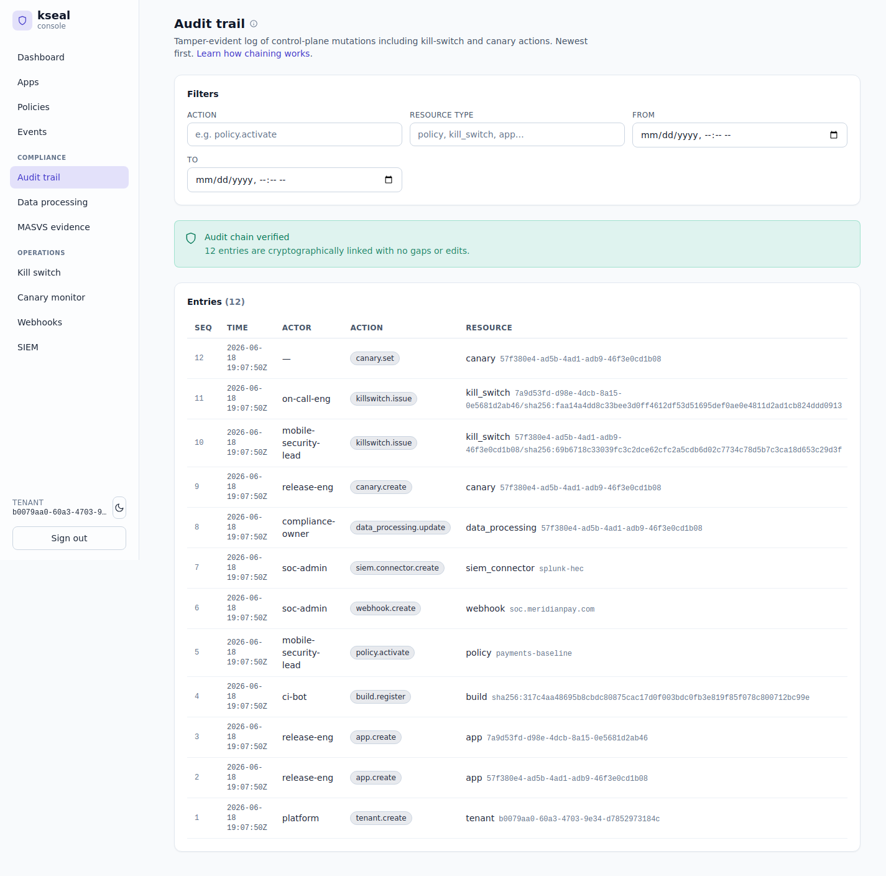

# Incident response & kill switch — cutting off a bad build in seconds, with receipts

**Meridian Pay team:** Trust & Safety / incident response. Acts fast during an incident and
answers to payment networks, partners and platform stores afterward.
**Job to be done:** *"When a compromised build or abuse wave hits, I need to cut it off in
seconds — and I need a tamper-evident record that proves exactly what I did and when."*

The deployment is the canonical [Meridian Pay reference](../reference/fixtures/README.md):
tenant `meridian`, apps `pay-android` and `merchant`, regions US/DE/BR/IN/SG.

---

## The problem

When a repackaged build of `pay-android` starts moving money — the **D3 / CRITICAL** scenario
from [chapter 1](01-server-authoritative-trust.md) seen at scale — every minute of delay is
fraud loss and reputational damage. The incident-response lead needs a **big red button** that
takes effect immediately and globally. But a big red button with no audit trail is its own
liability. After the incident, the payment network and the stores will ask: *who flipped it,
when, and can you prove the record wasn't edited?*

---

## What the incident-response team does in kseal

### The incident: arm the signed kill switch

The lead issues a **remote kill switch** for the exact compromised `build_hash`. It isn't a
mutable flag in a database — it's a **cryptographically signed command** the device verifies
offline before honoring. This is a real, reproducible artifact in
[`control/kill-switch-command.json`](../reference/fixtures/control/kill-switch-command.json):

```json
"signed_kill_switch": {
  "tenant_id": "meridian", "app_id": "pay-android",
  "build_hash": "e3bb7952a304da35ff93f5ddc20aa9220c6cc9be462016ae2985af3e76a70d73",
  "command": "KILL_SWITCH_COMMAND_DISABLE", "version": 1,
  "issued_at_iso": "2026-06-16T04:30:00Z", "reason": "compromised-build-2026-06-16"
},
"verification": { "algorithm": "Ed25519", "preimage_len_bytes": 175 }
```

Three properties make it safe:

- **It's signed, not stored.** The signature is a real Ed25519 signature over a
  length-prefixed preimage (`DOMAIN || tenant || app || build_hash || command || version ||
  issued_at || reason`) and verifies against the pinned public key
  `qO4rAwt8obLT+tUb2utUnxz4s+8Juf7xSJp2UAXP2Mk=`. The **same preimage is reconstructed
  byte-for-byte by the Rust core** (`crypto::kill_switch_preimage`) **and the Go server**
  (`compliance.killSwitchPreimage`) — a flipped `command` or `build_hash` fails verification
  and is ignored (fail-safe).
- **It's scoped and anti-rollback.** `command=DISABLE` kills trust for *exactly* this
  `build_hash`; every other build is implicitly `ENABLE`. `version` is monotonic per scope, so
  an attacker can't replay an older "stand down."
- **It's delivered inside the signed config envelope.** The switch rides in the same signed
  `ConfigResponse` as policy, so the device verifies it offline against the pinned key and it
  takes effect on the next attestation — globally, in seconds, with no client-side trust in a
  plaintext flag.

The console scopes the switch to an app (or a specific build) and shows its current state; the
signing and authority stay server-side — the console only requests the change:


*The kill switch scoped to `pay-android`: armed and enforcing normally, with a single
`Disable enforcement…` action that issues the signed command for incident response.*

### The receipts: a hash-chained audit trail

Every control-plane action — issuing the kill switch, rolling policy, rotating a connector — is
written to a **tamper-evident, hash-chained audit log** in
`server/control-plane/compliance/`. Each entry carries the actor, action, resource and a chain
hash linking it to the previous entry. The console recomputes the chain on load and refuses to
show "verified" if a single row was edited or deleted. That is the difference between *a log*
and *evidence*: a deleted or altered row breaks the chain and is provably detectable.


*Meridian's audit trail: the console reports the chain **verified** and lists every mutation —
`tenant.create`, `app.create`, `policy.activate`, `killswitch.issue`, `canary.set` — with its
actor and the resource it touched.*

### The same events reach the SOC

The decisions and mutations also stream to Meridian's SIEM as the minimized event contract
([`egress/siem-event.json`](../reference/fixtures/egress/siem-event.json)) for long-term
correlation — the same named-signal payload the [mobile-security
chapter](01-server-authoritative-trust.md) relies on, so there's no second pipeline to build.

---

## How the incumbents handle this

| Capability | kseal | Approov | Guardsquare/Appdome | Castle/Arkose |
|---|---|---|---|---|
| Signed, client-verifiable remote kill switch | **Built-in** | Token/rotation controls | App-side controls vary | N/A |
| Takes effect globally in seconds on next attestation | **Yes** | Yes | Varies | N/A |
| **Hash-chained, console-verified** audit of every mutation | **Built-in** | DIY / external logging | DIY | Partial |
| SIEM streaming of the same events | **Built-in** | DIY | DIY | Partial |

The kill capability exists in various forms across the incumbents, but the **tamper-evident,
self-verifying audit trail** — the part that turns an action into *defensible evidence* — is
typically something a customer is expected to build with external logging infrastructure.

---

## Back-tested evidence

The "with receipts" promise is the part that's easy to fake and hard to prove — so it's the
part tested hardest (full numbers in [Evidence & back-testing](evidence-and-backtesting.md)):

- **The kill switch is signed, not just stored.** The fixture's signature verifies against the
  pinned key, and the signed-envelope path is covered end-to-end by `e2e_config_test.go`
  (Ed25519 verify + TTL + version rotation). Clients verify before honoring, so an attacker
  can't forge a "stand down" or replay an old state.
- **The audit chain self-verifies.** Every mutation is a hash-chained entry in
  `server/control-plane/compliance/`; the console recomputes the chain on load and refuses to
  report "verified" if a single row was edited or deleted.
- **The same events reach the SIEM, minimized.** `e2e_telemetry_test.go` proves zstd ingest →
  queryable read-back with filters + keyset pagination and quota enforcement, so the SOC's
  long-term correlation store gets the events without a bespoke pipeline.

---

## Why it wins for the incident-response team

- **Speed with safety.** A signed kill switch that clients can't forge, effective globally in
  seconds.
- **Receipts by default.** The hash-chained audit isn't a feature you enable — it's how every
  mutation is recorded, and the console proves the chain is intact.
- **One product.** Detection, response and the evidentiary record live together, so the lead
  isn't stitching tools during an incident.

> JTBD met: *cut off the bad build in seconds, and walk into the post-incident review with a
> cryptographically verifiable record of exactly what happened.*
