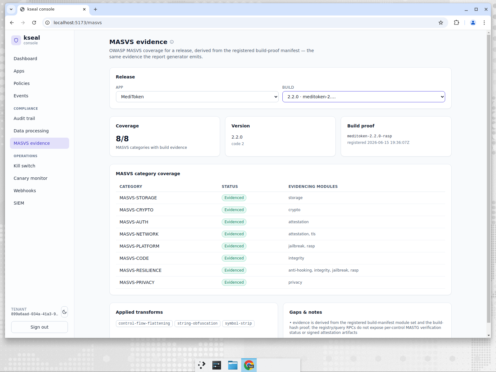
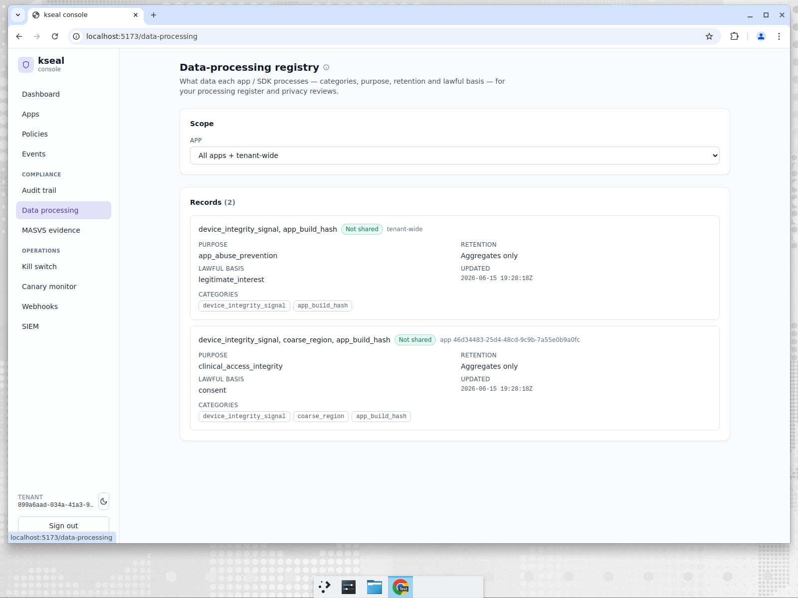
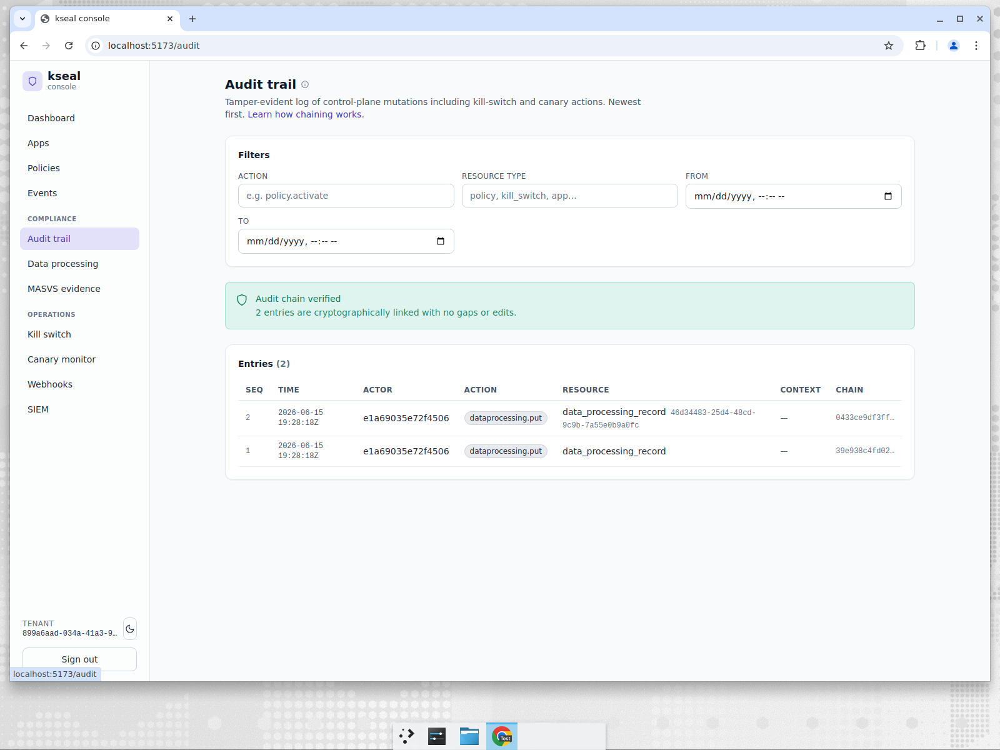

# MediToken — turning a build into compliance evidence

**Company:** MediToken, a regulated digital-health app handling clinical access.
**Persona:** Compliance / AppSec owner. Faces auditors, security questionnaires from
enterprise customers, and OWASP-MASVS expectations.
**Job to be done:** *"For every release I ship, prove our OWASP-MASVS coverage and document
exactly what data we process and how long we keep it — without a manual evidence-gathering
fire drill every audit."*

---

## The problem

Regulated apps live and die by evidence. When an auditor or an enterprise customer asks *"do
you meet MASVS-STORAGE? MASVS-RESILIENCE? what personal data do you process?"*, the answer
can't be a slide deck written from memory. It has to be **derived from what actually shipped**
and tied to a specific, identifiable build. Hand-maintained compliance spreadsheets are both
a time sink and a liability — they drift from reality the moment a build changes.

---

## What MediToken does in kseal

### MASVS coverage, derived from the build itself

When MediToken registers a release build, the build carries a **build-proof manifest** — the
hardening module set compiled into the release plus the applied code transforms. kseal maps
that manifest onto OWASP-MASVS categories — *the same evidence the report generator emits* —
and surfaces it in the console:

For release **`2.2.0` (`meditoken-2.2.0-rasp`)**, registered with a signed build proof:

- **Coverage: 8/8** MASVS categories with build evidence.
- Each category — **STORAGE, CRYPTO, AUTH, NETWORK, PLATFORM, CODE, RESILIENCE, PRIVACY** —
  is marked **Evidenced**, with the **specific modules** that evidence it (e.g.
  `MASVS-RESILIENCE` ← `anti-hooking, integrity, jailbreak, rasp`).
- **Applied transforms** are listed explicitly: `control-flow-flattening`,
  `string-obfuscation`, `symbol-strip`.
- A **Gaps & notes** panel is honest about provenance: the evidence is derived from the
  registered build-manifest module set and the build-hash proof — it does not over-claim
  per-control signed attestation artifacts it doesn't have.

That last point matters for a compliance tool: it states exactly what the evidence *is* and
*isn't*, which is what keeps an auditor's trust.

### A data-processing registry that documents itself

The data-processing registry records each processing activity — here a tenant-default
`app_abuse_prevention` record and an app-scoped `clinical_access_integrity` record — both
declaring **"Aggregates only"** retention. This is the artifact that answers the
privacy/DPIA questions in a security questionnaire, kept *in the platform* next to the
controls it describes.

### Every change is evidence, too

Registering those data-processing records produced **hash-chained audit entries**, and the
console verifies the chain: *"Audit chain verified — entries are cryptographically linked with
no gaps or edits."* So the *act of documenting* is itself tamper-evident.

---

## How the incumbents handle this

| Capability | kseal | Guardsquare/Appdome | Approov | Castle/Arkose |
|---|---|---|---|---|
| OWASP-MASVS coverage **derived from the actual build** | **Built-in** | Hardening reports, partial mapping | Not the focus | N/A |
| Coverage tied to an identifiable signed build-hash proof | **Yes** | Varies | N/A | N/A |
| In-product data-processing / retention registry | **Built-in** | No | No | No |
| Tamper-evident audit of compliance changes | **Built-in** | DIY | DIY | Partial |
| Honest provenance (states what evidence is/isn't) | **Yes** | Varies | N/A | N/A |

App-hardening vendors can produce hardening reports, but a self-documenting **MASVS-from-
build-proof view plus a data-processing registry plus a tamper-evident change log**, in one
place, aimed at the compliance owner, is not something the SME would otherwise get without
assembling tools and maintaining spreadsheets.

---

## Back-tested evidence

Compliance evidence that can't be reproduced isn't evidence — so MediToken's view is
derived from tested code, and is honest about its own provenance (full numbers in
[Evidence & back-testing](evidence-and-backtesting.md)):

- **The minimization claim is a test, not a promise.** `privacy_contract_test.go` asserts
  the telemetry schema carries **only minimized, non-PII fields** — the machine-checked
  backing for the registry's "Aggregates only" retention records.
- **The change log is tamper-evident by construction.** Registering each data-processing
  record writes a hash-chained audit entry (`server/control-plane/compliance/`) that the
  console re-verifies on load — so the *act of documenting* is itself evidence.
- **The view states what it isn't.** Coverage (8/8) is derived from the registered
  build-manifest module set and the build-hash proof; the *Gaps & notes* panel explicitly
  declines to claim per-control signed attestation artifacts it doesn't have. That honesty
  is what keeps an auditor's trust — and it's the same evidence the report generator under
  `tools/masvs-report/` emits.

---

## Why it wins for MediToken

- **Evidence, not memory.** MASVS coverage is derived from what actually shipped and tied to a
  signed build hash.
- **Audit-ready honesty.** The view states its own provenance and gaps — exactly what keeps
  auditors comfortable.
- **No evidence fire drill.** Data-processing records and a verifiable change log live in the
  platform, ready when the questionnaire arrives.

> JTBD met: *every release proves its MASVS coverage and documents its data processing,
> derived from the build itself — no manual evidence gathering.*
