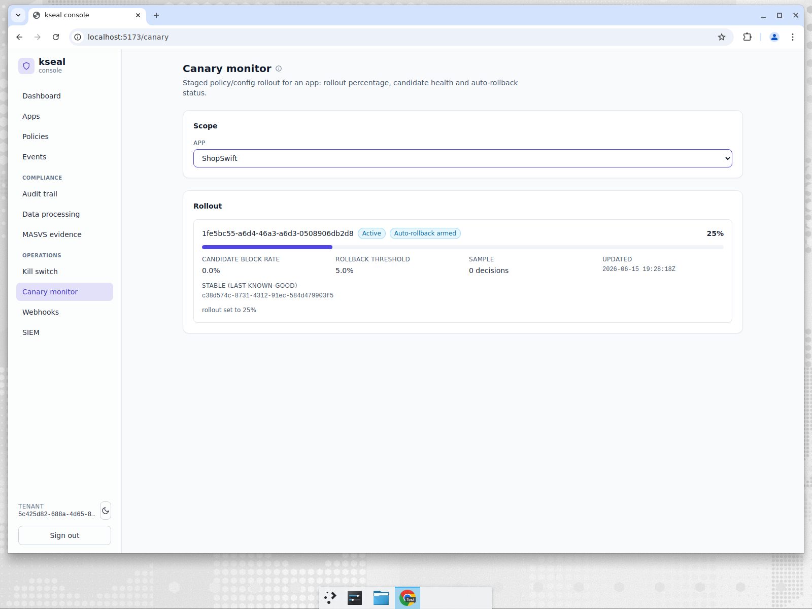

# ShopSwift — shipping a policy change with a seatbelt

**Company:** ShopSwift, a high-traffic e-commerce app.
**Persona:** Release engineer. Owns config/policy changes and is terrified of the change that
takes down checkout for everyone at once.
**Job to be done:** *"Let me roll a stricter trust policy out to a slice of traffic, watch
its health, and have the system automatically revert if it starts hurting real users — so I
can ship on a Friday."*

---

## The problem

A trust/risk policy is production config with teeth. Make it too strict and you start
blocking legitimate customers at checkout; make the change to 100% at once and you find out
the hard way, at full blast. The release engineer wants the same discipline they already
have for app rollouts — **stage to a percentage, watch a guardrail metric, auto-revert on
regression** — but for the *server-side trust policy*, and without standing up a separate
experimentation platform to get it.

---

## What ShopSwift does in kseal

ShopSwift stages a **candidate policy** to a slice of traffic with an armed guardrail:

The canary monitor shows the live rollout for the ShopSwift app:

- Candidate policy **`1fe5bc55-…`**, state **Active**, **Auto-rollback armed**.
- **Rollout: 25%** — only a quarter of instances are routed into the candidate cohort; the
  rest stay on the stable, last-known-good policy.
- **Candidate block rate: 0.0%** against a **Rollback threshold: 5.0%** — the candidate cohort
  is healthy, so the rollout proceeds.
- **Stable (last-known-good): `c38d574c-…`** — the exact policy kseal will instantly revert to
  if the guardrail trips.

The mechanism behind the screen: kseal deterministically buckets each instance into the
candidate or stable cohort, attributes every live trust decision to its cohort, and a
controller continuously measures the candidate cohort's **block rate** over a trailing window.
If that rate crosses the threshold with enough samples to be statistically meaningful, kseal
**auto-rolls-back** to the last-known-good policy and writes a signed audit entry recording
the breach and the revert — no human in the loop, no 2 a.m. page. Promotion and rollback are
also available as explicit controls when the engineer wants to drive it manually.

This is the release engineer's seatbelt: stage small, measure automatically, revert
automatically, and keep a tamper-evident record of what happened.

---

## How the incumbents handle this

| Capability | kseal | Approov | Guardsquare/Appdome | Castle/Arkose |
|---|---|---|---|---|
| Staged % rollout of a **server-side trust policy** | **Built-in** | Limited (policy/rotation) | App-config oriented | Rule changes, varies |
| Block-rate guardrail with **automatic** rollback | **Built-in** | DIY | DIY | Manual/analyst |
| Deterministic candidate/stable cohorting per instance | **Yes** | No | No | Varies |
| Auto-revert writes a tamper-evident audit entry | **Yes** | DIY | DIY | Partial |

Progressive delivery is a well-understood idea — but having it built into the **trust-policy**
layer, with an automatic block-rate guardrail and an audit-logged auto-rollback, is something
SMEs would otherwise approximate by bolting a feature-flag/experimentation tool onto a system
that wasn't designed for it.

---

## Back-tested evidence

The seatbelt is only worth trusting if it's been crash-tested — and the canary controller is
tested in **both** directions (full numbers in [Evidence & back-testing](evidence-and-backtesting.md)):

- **Rollback fires when it should — and not when it shouldn't.** `controller_test.go`
  asserts the guardrail rolls back **above** the block-rate threshold *and* is suppressed
  **below** the minimum-sample count, so a few unlucky early decisions can't trigger a
  spurious revert.
- **Bucketing is deterministic and stable.** `bucket_test.go` proves
  `InCanary(tenant, app, instance, percent)` is deterministic per instance, monotonic in
  the percentage, and independent across tenants — so an instance doesn't flip cohorts
  between requests, and one tenant's rollout can't perturb another's.
- **Signed, cacheable config underneath.** The candidate/stable policies ride the same
  Ed25519-signed envelope proven by `e2e_config_test.go` (verify + ETag caching + TTL +
  version rotation) — config verification costs **≈ 49 µs** on device and only runs when a
  new signed config actually arrives.

---

## Why it wins for ShopSwift

- **Ship without holding your breath.** 25% exposure, automatic guardrail, instant revert to a
  known-good policy.
- **No experimentation platform required.** The canary lives in the trust layer itself.
- **Always a record.** Every promotion or auto-rollback is an audit entry, so the change
  history is defensible.

> JTBD met: *roll a stricter policy to a slice of traffic, let the system watch and
> auto-revert on regression, and ship with confidence — on a Friday.*

> **Showcase note:** the screenshot shows a healthy, freshly-staged 25% rollout (0% candidate
> block rate, guardrail armed). The auto-rollback controller, cohorting and guardrail
> evaluation are real and covered by the platform's test suite; we did not force a synthetic
> breach in this capture so as not to misrepresent a production incident.
