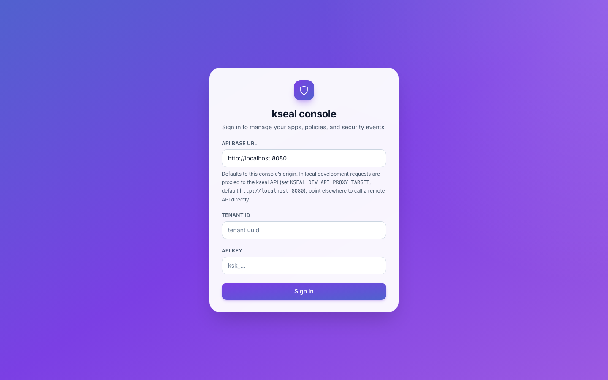

# Designing the kseal console: a KChat-family product experience

kseal is built for security teams who would rather spend their time *shipping* than
learning another dashboard. With that in mind, we recently aligned the console and
partner console around a single, polished product language: the same Inter
typography, the same purple-gradient brand palette, and the same calm, confident
spacing that powers [KChat](https://kchat.com/). This post walks through what changed
and why.

## One brand palette across every surface

The console used to ship with a generic indigo accent. We replaced it with the
KChat purple gradient — `#5161ce` through `#7b3fe4` to `#9b59e2` — so the product
family feels connected whether you land on the docs site, the marketing site, or the
console itself.

The semantic token layer means the palette stays accessible in both light and dark
modes:

- `accent` is the primary interactive color (lavender in dark mode, violet in light
  mode);
- `accent-strong` is the gradient endpoint for badges, buttons, and the brand shield;
- `accent-fg` is always white, so gradient buttons keep high contrast.

Every button, card, and badge uses these tokens, so a single CSS update reaches both
the console and the partner console.

## A more confident type system

We switched the console font stack to **Inter** and bumped the hierarchy so key
numbers and headings feel like a product people trust:

- Dashboard stats are now `text-3xl font-bold tracking-tight`, not `text-2xl
  font-semibold`;
- Page headers use a clear `title` / `description` pair with more breathing room;
- Tables and card headers share a consistent, slightly heavier weight (`font-semibold`)
  so scanability improves without shouting.

The result is a dashboard that reads like a premium analytics product, not a
config-tool bolt-on.

## Cards, buttons, and empty states

Cards now have a `rounded-2xl` radius, a soft `shadow-[0_2px_8px_rgba(0,0,0,0.04)]`,
and a subtle hover lift. Primary buttons carry the brand gradient, a matching shadow,
and a gentle `translateY` on hover. Empty states no longer look like placeholders:
they are centered, tinted, and rounded so the absence of data feels intentional.

These changes are applied to both consoles, so operators moving between the tenant
view and the partner/fleet view see one consistent visual language.

## Login and onboarding as first impressions

The login page is the first interaction most people have with kseal. It now opens
on a full KChat-gradient backdrop, a centered frosted-glass card, and a gradient
shield badge. The copy is shorter and benefit-led, not field-by-field instructions.

*The redesigned login page: a KChat-gradient background, a frosted-glass card, and
a centered gradient shield badge — the first impression is now as polished as the
architecture underneath.*

The onboarding checklist on the dashboard was rewritten the same way: fewer
configuration steps, more language about *protection* and *outcomes*. The goal is to
help a new user understand what kseal does for them before they read a single doc.

## What this means for the showcase

The Meridian Pay showcase screenshots used in the blog series and the
[`docs/showcase`](../docs/showcase/) pages now reflect this updated design. The
numbers, decisions, and fixtures are unchanged — the trust engine and build proofs
are the same as before — but the surface that presents them is cleaner and more
consistent with the rest of the KChat family.
