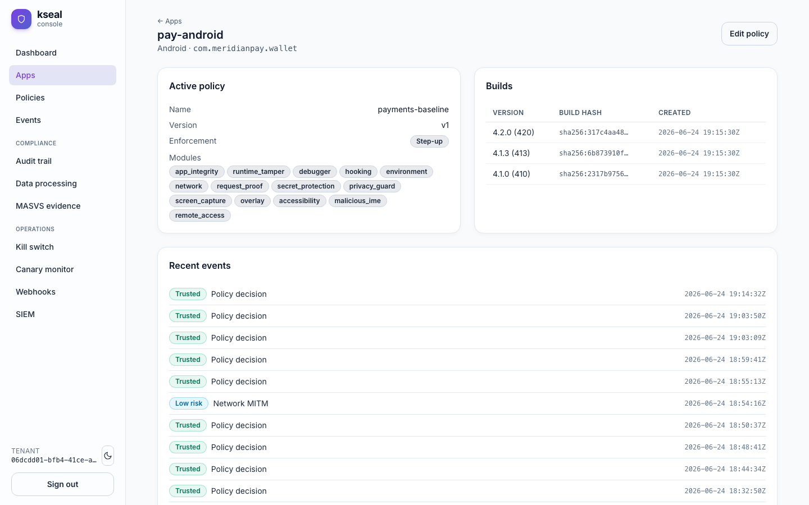

# Five fraud vectors mobile payments can't ignore

Classic RASP asks "is this device rooted, hooked, or emulated?" Those matter,
but they miss the abuse patterns behind most real-time payment fraud today — the
ones that work on a perfectly stock, unrooted phone. A scammer doesn't need to
crack the binary if they can watch the screen, draw a fake button over the real
one, or drive the app through the accessibility framework while the victim is on
the phone with "support."

kseal ships five on-device probes aimed squarely at these vectors. This post
covers what each one detects, the risk bit it raises, and how they compose in
Meridian Pay's two fraud scenarios.

## The five probes

Each probe sets a wire bit that `FromWire` maps to a dedicated server signal with
its own weight (full mapping in the
[risk-signals reference](https://github.com/kennguy3n/kseal/blob/main/docs/reference/risk-signals.md)):

| Vector | What it is | Wire bit | Server signal | Weight |
|---|---|---|---|---|
| **Screen capture** | Screen recorded or cast off-device — the attacker sees the PIN, balance, and one-time codes | `wireScreenCapture` (16) | `screen_capture` | 30 |
| **Overlay / tapjacking** | A window drawn over the app so taps land on a malicious surface, or the real amount/recipient is hidden | `wireOverlayAbuse` (17) | `overlay_abuse` | 35 |
| **Accessibility abuse** | A rogue accessibility service reads screen content and synthesizes taps — automating the app without the user | `wireAccessibility` (18) | `accessibility_abuse` | 40 |
| **Malicious IME** | A hostile keyboard keylogs entry or injects text into amount/recipient fields | `wireMaliciousIME` (19) | `malicious_ime` | 25 |
| **Remote access** | A screen-sharing / remote-control tool mirrors and drives the device live | `wireRemoteAccess` (20) | `remote_access` | 45 |

The weights rank the vectors by how directly they enable a fraudulent
*transaction*. Remote access (45) and accessibility abuse (40) score highest
because they let an attacker *act* as the user, not merely *observe* — exactly
the capability a remote-access scam needs.

!!! note "These are Android fraud vectors"
    Overlay, accessibility-driven automation, third-party IMEs and
    remote-control tooling are Android platform capabilities. On iOS these
    probes are intentional, permanent no-ops — the platform doesn't expose the
    same surfaces — and they simply contribute nothing to the score rather than
    pretending to measure something. kseal never raises a signal it can't
    actually observe.

## How they compose: Meridian's two fraud scenarios

The fraud probes are designed to be read *together*, because real attacks light
up several at once. Two of Meridian Pay's canonical scenarios are pure
fraud-vector cases (committed in
[`scenarios.json`](https://github.com/kennguy3n/kseal/blob/main/docs/reference/fixtures/scenarios.json)):

### D4 — overlay + accessibility tapjacking at checkout

A malicious accessibility service draws an overlay over the confirm-payment
screen to harvest the amount and PIN.

```
fused  = overlay_abuse | accessibility_abuse
score  = 35 + 40 = 75
level  = MEDIUM_RISK     (≥ 50)
mode   = STEP_UP
result = STEP_UP          → the payment is held for re-authentication
```

Neither signal alone clears `MEDIUM_RISK`, but together they cross 50 and the
payment can't complete silently — it's bounced to a step-up challenge.

### D5 — a remote-access scam in progress

A victim is talked into a screen-sharing "support" session while an
accessibility service drives the app and a remote-access tool mirrors the
screen.

```
fused  = screen_capture | accessibility_abuse | remote_access
score  = 30 + 40 + 45 = 115
level  = HIGH_RISK       (≥ 90)
mode   = STEP_UP
result = STEP_UP
```

Three probes firing at once push this to `HIGH_RISK`. In Meridian's `STEP_UP`
mode that's a step-up challenge that interrupts the attacker's script; a tenant
running `BLOCK` mode would have the same `HIGH_RISK` level denied outright. The
minimized event for this scenario is committed at
[`events/risk-event.json`](https://github.com/kennguy3n/kseal/blob/main/docs/reference/fixtures/events/risk-event.json).

Each fraud-vector hit lands as its own server-scored event in the console — here
in `pay-android`'s stream, `Malicious keyboard`, `Screen capture` and
`Runtime tamper` sit alongside the ordinary `Policy decision` rows:



*`pay-android`'s recent events in the refreshed console: the fraud-vector probes
(`Malicious keyboard`, `Screen capture`) surface as discrete events with their
own risk band, next to the policy decisions they feed into.*

## What the SOC sees

Because the decision is server-side, every fraud-vector hit becomes a structured
event the tenant's security team can act on. The same decision is delivered to
Meridian's Splunk as a minimized HEC event — `risk_signals` listing the exact
probes that fired, no PII — and optionally to a signed webhook. The egress client
is SSRF-hardened, and connector secrets stay server-side and never appear in
telemetry (see
[`egress/siem-event.json`](https://github.com/kennguy3n/kseal/blob/main/docs/reference/fixtures/egress/siem-event.json)).

A server-side surge of any one of these signals across the fleet is what
promotes the population-level `fleet_anomaly` signal — a coordinated overlay
campaign against Meridian shows up as a fleet anomaly even before any single
device looks unusual.

For the full scoring contract these bits flow through, read
[Inside the risk engine](inside-the-risk-engine.md); for the threat model behind
the probe set, see the [threat model](../docs/threat-model.md).
