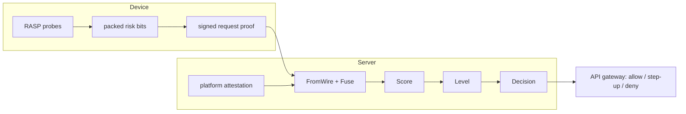

# Why the trust decision lives on the server

Most client-side app protection makes the same quiet bet: that the attacker
won't get past the on-device check. Roots, hooks, repackagers and emulators
exist precisely to win that bet. kseal takes the bet off the table by moving the
**decision** — allow, step-up, or deny — to the server. The client's job is to
*gather and sign evidence*; the server's job is to *decide*. A tampered client
can lie about the evidence it controls, but it cannot manufacture the
server-side signals, and it cannot mint a decision the backend will accept.

This post follows one request from our reference customer, **Meridian Pay**
(tenant `meridian`, app `pay-android`, enforcement mode `STEP_UP`), to show why
that split matters.

## The split: evidence on the device, decision on the server



The device reports what it can observe about itself as a compact bitset and
signs each sensitive request. But two things the device reports are not the
things the server trusts most:

- **Platform attestation** (Play Integrity / App Attest / DeviceCheck) is
  evaluated **server-side**. The phone forwards an attestation token, but the
  verdict — does this token correspond to a genuine, registered build? — is the
  server's to compute.
- **Fleet anomalies** are derived entirely server-side from the whole
  population and can never be reported by a device.

So the deciding weight in a high-stakes call comes from signals the client does
not own.

## Walking a repackaged build through the pipeline

An attacker repackages `pay-android`, patches the SDK, and runs it. On-device
self-integrity notices the binary no longer matches its build baseline and sets
one wire bit, `wireTamper`. Here is exactly what the server does (scenario **D3**
from [`scenarios.json`](https://github.com/kennguy3n/kseal/blob/main/docs/reference/fixtures/scenarios.json)):

```
device wire bits   = { wireTamper (6) }            → BitAppTamper
attestation bits   = { BitAttestationFail }        ← server-derived, not client-reported
fused              = BitAppTamper | BitAttestationFail
score              = 60 (app_tamper) + 70 (attestation_fail) = 130
level              = CRITICAL          (score ≥ 130)
mode               = STEP_UP
result             = DENY
```

The teaching moment is the arithmetic. The tamper bit on its own is worth
**60** — that is `MEDIUM_RISK`, which in `STEP_UP` mode would only trigger a
re-authentication. It is the **fusion** with the server-side attestation
failure (**70**) that crosses the `CRITICAL` threshold (130) and denies the
payment outright.

A tampered client cannot talk its own way out of this denial, because the
deciding weight came from a signal it does not control. Even if the attacker
patches the SDK to report *zero* risk bits, attestation still fails server-side,
contributing 70, and the build is `BitAppUnrecognized` (weight 65) as well —
either path keeps the decision well away from `ALLOW`.

## Why this is also fast

Server-authoritative does not mean slow. The full fuse-score-level computation
(`policy_evaluate`) runs in **~48 ns** and the per-request proof the client signs
(`request_proof_generate`) is **~349 ns** — both far below a network round-trip
(see the [benchmarks](https://github.com/kennguy3n/kseal/blob/main/docs/reference/benchmarks.md)).
Trust evaluation is effectively free relative to the API call it guards.

## What the rest of the system inherits from this choice

Because the decision is server-side, several hard problems become much easier:

- **Hardening is about cost, not perfection.** Build-time hardening and on-device
  RASP raise the price of an attack and slow analysis, but they never have to be
  *uncrackable* — the server still has the final say. See
  [Anatomy of a build proof](anatomy-of-a-build-proof.md).
- **Response is centralized.** A compromised build is disabled with a signed,
  anti-rollback [kill switch](https://github.com/kennguy3n/kseal/blob/main/docs/reference/fixtures/control/kill-switch-command.json)
  delivered to every device — no app-store round-trip.
- **Rollout is safe.** A tenant starts in `OBSERVE` (which never denies, only
  records), watches the scores, and only then turns on `STEP_UP` or `BLOCK`.

The mechanics of the scoring contract are in
[Inside the risk engine](inside-the-risk-engine.md); the
[architecture overview](../ARCHITECTURE.md) puts all four planes together.
