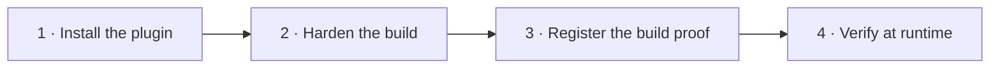

# Secure your app with kseal

A guided path from an unprotected app to an **attested, hardened release** — in
four steps. Each step works with sensible, ship-safe defaults; you only reach
for configuration when you want to.



!!! tip "What you'll have at the end"
    A release build whose strings/resources are encrypted, whose native posture
    is verified, and whose **build proof** is registered with the control plane —
    so your backend can refuse API traffic from any app instance that isn't a
    genuine, untampered build.

!!! info "Prerequisites"
    - **Android:** Gradle 8.11+, JDK 17, Android Gradle Plugin 8.7.x.
    - **iOS:** Swift 5.9+ toolchain (Xcode 15+ for device builds).
    - A kseal control-plane **tenant id**, **app id** and **API key** for the
      register + verify steps. You can do steps 1–2 fully offline first.

---

## Step 1 · Install the plugin

**Why it matters:** hardening happens *inside your own build*, so your source
never leaves CI and there's no per-build cloud compute. Installing the plugin is
the only wiring you need — identity and post-build artifacts are detected
automatically.

=== "Android (Gradle)"

    ```kotlin
    // app/build.gradle.kts
    plugins {
        id("com.android.application")
        id("io.kseal.android.harden") version "0.1.0"   // (1)!
    }
    ```

    1.  Applying the plugin alongside `com.android.application` auto-wires the
        package id, version, post-R8 classes, merged resources, `mapping.txt`
        and keep rules. Nothing else is required to get a safe default build.

    The plugin registers a `kseal` task group. Confirm it's wired:

    ```bash
    ./gradlew tasks --group kseal
    ```

=== "iOS (Xcode / SwiftPM)"

    ```swift
    // Package.swift — attach the build-tool plugin to your app target
    .executableTarget(
        name: "App",
        exclude: ["kseal-secure-strings.json"],
        plugins: [ .plugin(name: "KsealHardenPlugin", package: "KsealHarden") ]
    )
    ```

    The build-tool plugin runs automatically on every build of that target — no
    network, no extra build phase.

[:material-book-open-variant: Full Android plugin reference](https://github.com/kennguy3n/kseal/tree/main/plugins/gradle#configuration-reference) ·
[:material-book-open-variant: Full iOS plugin reference](https://github.com/kennguy3n/kseal/tree/main/plugins/xcode#quick-start)

---

## Step 2 · Harden the build

**Why it matters:** secrets and lookup keys embedded in an app are the first
thing an attacker greps for. kseal encrypts the strings/resources you flag,
optionally obfuscates bytecode control flow, strips debug metadata, and
**verifies** the native exploit-mitigation posture (RELRO, NX, PIE, stack
canary, FORTIFY, CFI/MTE/BTI/PAC) of every shared library — recording all of it
in the build proof.

=== "Android (Gradle)"

    Flag the resource keys to protect and (optionally) turn on bytecode
    obfuscation. Defaults are conservative and ship-safe:

    ```kotlin
    ksealHarden {
        keepStringKeys.add("app_name")          // never encrypt these keys

        obfuscation {
            enabled.set(true)                    // off by default
            strength.set("medium")               // off · low · medium · high
        }
    }
    ```

    Run the full pipeline:

    ```bash
    ./gradlew ksealHarden
    ```

    !!! warning "Strength is validated, not guessed"
        A typo such as `strength.set("maximum")` **fails the build** with the list
        of valid values — kseal never silently downgrades your protection.

=== "iOS (Xcode / SwiftPM)"

    List the literals to harden; the plugin replaces them with per-build
    obfuscated accessors so the plaintext never appears in source or binary:

    ```json
    // Sources/App/kseal-secure-strings.json
    { "apiBaseURL": "https://api.example.com", "telemetryKey": "…" }
    ```

    ```swift
    // Use the generated accessor instead of the literal:
    let url = KsealSecureStrings.apiBaseURL
    ```

    Building the target hardens the strings and emits the proof automatically.

**Reproducible by default.** With the default (non-randomized) seed, two clean
builds of identical inputs produce **byte-for-byte identical** hardened
artifacts and the same build hash. Pin a seed explicitly for auditable CI:

=== "Android (Gradle)"

    ```kotlin
    ksealHarden { polymorphism { explicitSeedHex.set("<64 hex chars>") } }
    // openssl rand -hex 32
    ```

=== "iOS (Xcode / SwiftPM)"

    ```bash
    export KSEAL_BUILD_SEED="$(openssl rand -hex 32)"
    ```

[:material-book-open-variant: Android build hardening](docs/build-hardening-android.md) ·
[:material-book-open-variant: iOS build hardening](docs/build-hardening-ios.md)

---

## Step 3 · Register the build proof

**Why it matters:** the **build proof** (`kseal.build-proof`) is a tamper-evident
manifest of exactly what was hardened — app + SDK identity, the seed digest,
tool versions, applied transforms and a sorted list of artifact hashes, bound
together by a single reproducible `build_hash`. Registering it lets the control
plane recognize genuine builds later.

=== "Android (Gradle)"

    ```kotlin
    ksealHarden {
        registry {
            endpoint.set("https://control.kseal.io")
            tenantId.set("acme")
            appId.set("checkout-android")
        }
    }
    ```

    ```bash
    ./gradlew ksealRegisterBuild -Pkseal.apiKey="$KSEAL_API_KEY"
    ```

=== "iOS (Xcode / SwiftPM)"

    ```bash
    export KSEAL_REGISTRY_URL=… KSEAL_API_KEY=… KSEAL_TENANT_ID=… KSEAL_APP_ID=…
    swift package --allow-network-connections all kseal-register
    ```

!!! note "Air-gapped or offline CI?"
    Both planes write a durable **uploadable manifest** when no endpoint/network
    is available, so you can register the proof from a separate, network-allowed
    job. The API key is read at execution time and **never logged**.

[:material-book-open-variant: CLI reference](docs/cli.md)

---

## Step 4 · Verify at runtime

**Why it matters:** hardening raises the cost of an attack; **attestation**
closes the loop. The kseal SDK establishes a server-authoritative trust session
that binds each API request to an attested, untampered instance of *this*
registered build. Your backend then trusts only genuine clients — a repackaged
or hooked app fails attestation and is refused.

- The on-device SDK collects runtime posture (integrity, debugger/hook/root or
  jailbreak signals) and proves it to the control plane.
- The control plane checks that posture **against the registered build proof**
  from Step 3 and issues a short-lived trust token.
- Your API gateway requires a valid trust token, so compromised clients can't
  call your backend even with valid user credentials.

[:material-book-open-variant: Threat model](docs/threat-model.md) ·
[:material-book-open-variant: Desktop SDK](docs/desktop-sdk.md) ·
[:material-book-open-variant: Policy packs](docs/policy-packs.md)

---

## Prove it for compliance

Every hardened build can emit a **MASVS evidence report** mapping what kseal did
to MASVS controls — useful for audits and app-store review.

[:material-file-document-check: MASVS mapping](docs/masvs-mapping.md) ·
[:material-file-document-check: MASVS evidence report](docs/masvs-evidence.md) ·
[:material-scale-balance: How kseal compares](docs/feature-parity-matrix.md)

## Troubleshooting

| Symptom | Fix |
|---|---|
| `unknown obfuscation strength '…'` | Use `off`, `low`, `medium` or `high` in `obfuscation.strength`. |
| `explicitSeedHex must be exactly 64 hex characters` / `--build-seed must be hex-encoded…` | Generate a seed with `openssl rand -hex 32`. |
| `tenantId is required for online registration` | Set `tenantId`/`appId`, or run offline and register later. |
| `API key not found` | Provide `-Pkseal.apiKey=…` / `KSEAL_API_KEY`, or use the offline manifest. |

!!! question "Stuck?"
    Open an issue on [GitHub](https://github.com/kennguy3n/kseal/issues) — include
    the failing task's `--info` output (it never contains secrets).
